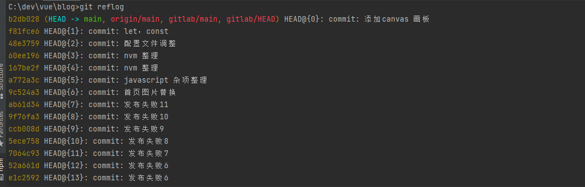
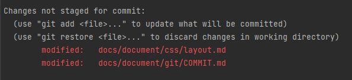

# Git 命令


## 版本回退
### 1. 运行git reflog 查看你的历史变更记录， 如下


### 2. 然后用 `git reset --hard HEAD@{n}` (n是你要回退的引用位置) 回退；比如上图可运行 `git reset --hard 48e3759`

```shell
# git reset 和 git revert 的区别?

git reset --hard {commitHashId} # 回退到某个版本 
git revert --n {commitHashId} # 回退到某一个commit,会生成一个新的版本,反转覆盖掉原来的提交代码
```

### 3. commit 后的东西想取消

```shell
git reset --soft HEAD^   # 如果想把add 一起取消就把 --soft 改成 --hard
```
`HEAD^ `表示上一个版本，即上一次的commit 也可以写成HEAD~1 如果进行两次commit ，都想撤回，可以使用HEAD~2  

–soft  
不删除工作空间的改动代码 ，撤销commit，不撤销git add file  

–hard  
删除工作空间的改动代码，撤销commit且撤销add  


## 用户名，邮箱设置
```shell
# 查看用户和邮箱
git config user.name
git config user.email
# 当前项目
git config user.name "John Doe"
git config user.email johndoe@example.com
# 全局项目
git config --global user.name "John Doe"
git config --global user.email johndoe@example.com
```
::: tip 注意
如果使用了 --global 选项，那么该命令只需要运行一次，因为之后无论你在该系统上做任何事
情， Git 都会使用那些信息。 当你想针对特定项目使用不同的用户名称与邮件地址时，可以在那个项目目录下运
行没有 --global 选项的命令来配置。
:::

## 在提交（commit） 后发现尚未暂存某些需要修改的文件
- 例如
```shell
git commit -m 'initial commit'
git add forgotten_file
git commit --amend # 最终你只会有一个提交——第二次提交将代替第一次提交的结果
```
::: info 修复旧提交
当你在修补最后的提交时，与其说是修复旧提交，倒不如说是完全用一个 新的提交 替换旧的
提交， 理解这一点非常重要。从效果上来说，就像是旧有的提交从未存在过一样，它并不会
出现在仓库的历史中。<br/>
修补提交最明显的价值是可以稍微改进你最后的提交，而不会让“啊，忘了添加一个文件”或
者 “小修补，修正笔误”这种提交信息弄乱你的仓库历史。
:::

## 撤消对文件的修改



- 如上图 <span style="color: red">Changes not staged for commit</span>（已更改）的文件

```shell
 git checkout --  docs/document/css/layout.md # 将撤销之前所有的修改
```
::: info 注
请务必记得 `git checkout -- <file>` 是一个危险的命令。 你对那个文件在本地的任何修
改都会消失——Git 会用最近提交的版本覆盖掉它。 除非你确实清楚不想要对那个文件的本地
修改了，否则请不要使用这个命令。
:::

## 从远程仓库中抓取与拉取

```shell
git fetch <remote>
```
::: info 注
必须注意 git fetch 命令只会将数据下载到你的本地仓库——它并不会自动合并或修改你当前的工作。 当准备好时你必须手动将其合并入你的工作。<br/>
git pull 通常会从最初克隆的服务器上抓取数据并自动尝试合并到当前所在的分支。

:::

## 新建删除标签

### 1. 新建
```shell
git tag # 查看标签
git tag <tagName> # 新建轻量标签
git tag -a '标签名' # 添加新标签
git tag -a '标签名' -m '附注' # 添加附注新标签
git tag -a '标签名' `commitId` # 添加之前版本新标签
```
::: info 标签创建成功后需要推送到远程仓库
- `git push <remote> <tagName>` 
- `git push` 推送两种标签用 `git push <remote> --tags` 推送标签并不会区分轻量标签和附注标签， 没有简单的项能够让你只选择推送一种标签。
:::

### 2. 删除
```shell
 git tag -d <tagname> # 删除一个轻量标签,删除掉本地仓库
 git push <remote> :refs/tags/<tagname> # 来更新你的远程仓库
 
 git push origin --delete <tagname> # 删除远程标签
```

## 命令列表

::: info Git

| 命令 |  介绍 |
|:-----|------|
|`git clone` |默认是下载了所有分支的代码|
|`git branch` |打印出所有的分支，以及当前所在分支|
|`git branch -a` |查看项目所有分支|
|`git branch -r` |查看项目所有远程分支|
|`git checkout '分支名'` |切换分支|
|`git checkout -b '分支名'` |新建并切换到分支|
|`git rm '文件名'` |删除本地仓库目标文件|
|`git rm -f '文件名'` |强制删除本地仓库目标文件|
|`git log` |查看提交记录， 退出英文状态下Q|
|`git reflog` |可查看修改记录，（包括git reset 的回退记录）|
|`git reset --hard {commit id}`  |回退版本|
|`git tag`  |查看标签|
|`git tag -a '标签名'`  |添加新标签|
|`git tag -a '标签名' -m '附注'`  |添加附注新标签|
|`git tag -a '标签名' `commitId`  |添加之前版本新标签|
|`git stash`  |代码放进暂存区（未被commit的代码）|
|`git stash apply` |还原|
|`git stash drop` |清除最近一次的stash记录|
|`git stash pop` |还原并清除最近一次stash|
|`git stash list` |查看暂存列表|
|`git stash clear` |清空所有stash记录|
|`git remote -v`  |显示所有远程仓库|
|`git remote add 'url'`   |添加一个远程仓库|
|`git remote rm 'name'`   |删除一个远程仓库|
|`git remote rename 'old_name' 'new_name'`   |修改仓库名|

:::

