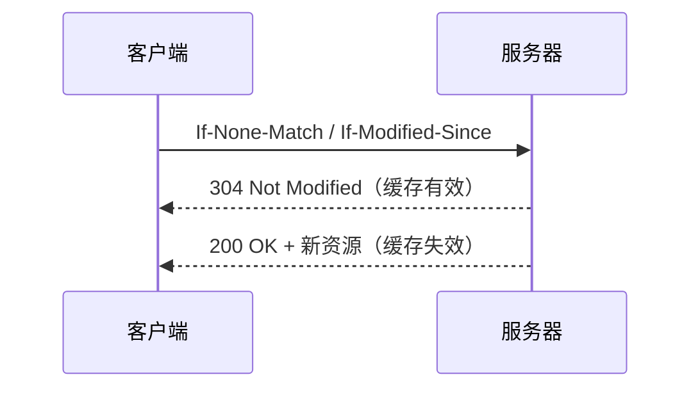
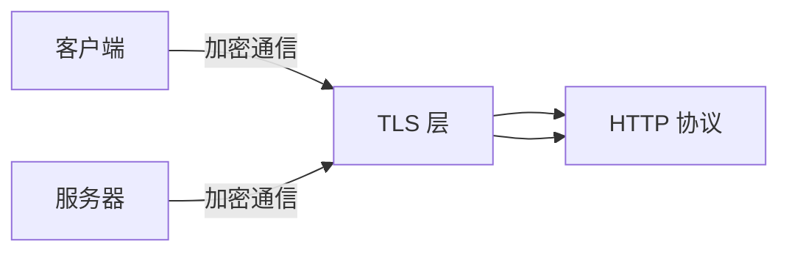
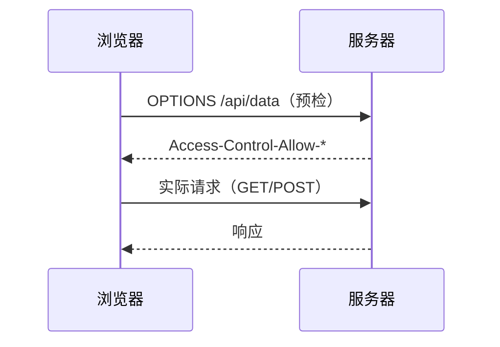

# HTTP

## 一、HTTP 基本概念

**HTTP**（HyperText Transfer Protocol，超文本传输协议）是应用层协议，用于客户端（浏览器）与服务器之间的通信。

- **无状态**：每个请求独立，服务器不记忆之前的请求（Cookie/Session 补充）
- **无连接**：HTTP/1.1 之前每次请求结束后断开连接，1.1 起默认持久连接（Keep-Alive）
- **明文传输**：HTTP 内容以明文发送（HTTPS 解决此问题）

## 二、HTTP 请求方法

| 方法 | 含义 | 是否幂等 | 请求体 |
|------|------|---------|--------|
| GET | 获取资源 | ✓ | 无 |
| HEAD | 获取响应头（无响应体） | ✓ | 无 |
| POST | 提交/创建资源 | ✗ | 有 |
| PUT | 完整更新资源 | ✓ | 有 |
| PATCH | 部分更新资源 | ✗ | 有 |
| DELETE | 删除资源 | ✓ | 可有可无 |
| OPTIONS | 预检请求（查询支持的请求方法等） | ✓ | 无 |

> **幂等**：同一个请求执行多次和执行一次的效果相同

## 三、HTTP 状态码

### 1xx — 信息性

| 状态码 | 含义 |
|--------|------|
| 100 Continue | 继续发送请求体 |
| 101 Switching Protocols | 切换协议（如 WebSocket） |

### 2xx — 成功

| 状态码 | 含义 |
|--------|------|
| 200 OK | 请求成功 |
| 201 Created | 创建成功（通常用于 POST） |
| 204 No Content | 成功但无响应体（如 DELETE） |
| 206 Partial Content | 范围请求成功（断点续传） |

### 3xx — 重定向

| 状态码 | 含义 |
|--------|------|
| 301 Moved Permanently | 永久重定向（浏览器缓存，下次直接访问新 URL） |
| 302 Found | 临时重定向（始终先访问原 URL） |
| 304 Not Modified | 缓存有效（协商缓存命中） |
| 307 Temporary Redirect | 临时重定向（不允许改变请求方法） |
| 308 Permanent Redirect | 永久重定向（不允许改变请求方法） |

### 4xx — 客户端错误

| 状态码 | 含义 |
|--------|------|
| 400 Bad Request | 请求语法错误 |
| 401 Unauthorized | 未认证（需登录） |
| 403 Forbidden | 已认证但无权限 |
| 404 Not Found | 资源不存在 |
| 405 Method Not Allowed | 请求方法不被允许 |
| 408 Request Timeout | 请求超时 |
| 409 Conflict | 资源冲突（如版本冲突） |
| 413 Payload Too Large | 请求体过大 |
| 429 Too Many Requests | 请求频率过高（限流） |

### 5xx — 服务端错误

| 状态码 | 含义 |
|--------|------|
| 500 Internal Server Error | 服务器内部错误 |
| 502 Bad Gateway | 网关/代理错误 |
| 503 Service Unavailable | 服务暂不可用（过载/维护） |
| 504 Gateway Timeout | 网关超时 |

## 四、HTTP 首部（Headers）

### 通用首部

```
Date: 响应时间
Cache-Control: 缓存控制
Connection: keep-alive / close
```

### 请求首部

```
Host: 目标主机（必需）
User-Agent: 客户端信息
Referer: 请求来源地址
Origin: 请求来源（CORS 用，比 Referer 更安全）
Authorization: 认证凭证（Bearer token / Basic auth）
Content-Type: 请求体格式（application/json、multipart/form-data 等）
Accept: 客户端接受的响应类型
Accept-Encoding: 接受的编码（gzip, deflate, br）
Accept-Language: 接受的语言
Cookie: 携带的 cookie
If-Modified-Since: 协商缓存的修改时间
If-None-Match: 协商缓存的 ETag
```

### 响应首部

```
Set-Cookie: 设置 cookie
Cache-Control: 缓存指令
ETag: 资源唯一标识（用于协商缓存）
Last-Modified: 资源最后修改时间
Location: 重定向目标 URL
Access-Control-Allow-Origin: CORS 允许的源
Access-Control-Allow-Methods: CORS 允许的方法
Access-Control-Allow-Headers: CORS 允许的请求头
Access-Control-Allow-Credentials: CORS 是否允许携带凭证
```

### Content-Type 常见值

| 值 | 用途 |
|----|------|
| application/json | JSON 数据 |
| application/x-www-form-urlencoded | 表单提交（默认） |
| multipart/form-data | 文件上传 |
| text/html | HTML 文档 |
| text/plain | 纯文本 |
| application/octet-stream | 二进制流（下载文件） |

## 五、HTTP 缓存机制

### 强缓存（不请求服务器）

浏览器判断缓存是否过期，若未过期则直接使用缓存（状态码 200 from disk/memory cache）。

```
Cache-Control: max-age=3600          # HTTP/1.1 优先级更高
Expires: Wed, 21 Oct 2025 07:28:00   # HTTP/1.0（绝对时间，依赖系统时间）
```

- `Cache-Control: no-cache` — 不使用强缓存（但可走协商缓存）
- `Cache-Control: no-store` — 完全不缓存
- `Cache-Control: public` — 任何节点都可缓存（CDN）
- `Cache-Control: private` — 仅浏览器可缓存

### 协商缓存（向服务器确认）

强缓存失效后，携带缓存标识向服务器发送请求：



**方式一：Last-Modified / If-Modified-Since**

- 服务器返回 `Last-Modified: 文件最后修改时间`
- 下次请求客户端带 `If-Modified-Since: 该时间`
- 缺点：文件周期性修改但内容不变时也会重新下载；1秒内多次修改无法识别

**方式二：ETag / If-None-Match（优先级更高）**

- 服务器返回 `ETag: 文件哈希值`
- 下次请求客户端带 `If-None-Match: 该哈希值`
- 解决了 Last-Modified 的缺点

## 六、HTTPS

HTTPS = HTTP + TLS/SSL（传输层加密）



**核心流程（TLS 握手）：**

1. 客户端请求服务器，发送支持的加密套件列表
2. 服务器返回数字证书（包含公钥）
3. 客户端验证证书合法性（CA 链）
4. 客户端生成对称密钥，用服务器公钥加密后发送
5. 服务器用私钥解密得到对称密钥
6. 后续使用对称密钥加密通信（效率高）

**为什么 HTTPS 安全：**

- **加密** — 防止窃听（对称加密 + 非对称加密）
- **完整性** — 防止篡改（消息认证码）
- **身份验证** — 防止冒充（CA 数字证书）

## 七、HTTP/1.1 vs HTTP/2 vs HTTP/3

| 特性 | HTTP/1.1 | HTTP/2 | HTTP/3 |
|------|----------|--------|--------|
| 传输层 | TCP | TCP | QUIC (基于 UDP) |
| 多路复用 | ✗（队头阻塞） | ✓（一个 TCP 连接并发多个请求） | ✓（无 TCP 队头阻塞） |
| 头部压缩 | ✗ | ✓（HPACK） | ✓（QPACK） |
| 服务端推送 | ✗ | ✓ | ✓ |
| 连接建立 | TCP 三次握手 | TCP + TLS | 0-RTT（快） |
| 二进制传输 | ✗（文本） | ✓（帧） | ✓（帧） |

**HTTP/1.1 优化手段：**

- 域名分片（多个域名提高并发）
- 资源合并（雪碧图、CSS/JS 合并）
- 内联资源（Data URI）

**HTTP/2 核心改进：**

- 二进制分帧层：将请求/响应拆分为帧（HEADERS 帧、DATA 帧等）
- 多路复用：一个连接内交错发送多个请求/响应的帧，解决了队头阻塞
- 头部压缩：HPACK 算法将重复头部压缩 85%+
- 服务器推送：服务器可主动推送客户端可能需要的资源

**HTTP/3 核心优势：**

- 基于 QUIC（UDP），解决了 HTTP/2 的 TCP 队头阻塞问题
- 0-RTT 连接建立（之前连接过的场景）
- 连接迁移（切换网络时连接不中断）

## 八、CORS（跨域资源共享）

### 简单请求

满足以下条件：

- 方法：GET、HEAD、POST
- Content-Type：text/plain、multipart/form-data、application/x-www-form-urlencoded
- 无自定义请求头

浏览器直接发送请求，通过 `Access-Control-Allow-Origin` 判断是否允许。

### 预检请求（非简单请求）



触发预检的条件：

- 使用了 PUT、DELETE、PATCH 等方法
- Content-Type 为 application/json 等非简单类型
- 使用了自定义请求头（如 Authorization、X-Custom-Header）

### 常见 CORS 配置

```
// 允许所有源（不安全）
Access-Control-Allow-Origin: *

// 允许特定源
Access-Control-Allow-Origin: https://example.com

// 允许携带凭证（cookie 等）
Access-Control-Allow-Credentials: true
// ⚠️ 此时 Access-Control-Allow-Origin 不能为 *

// 暴露自定义响应头给前端
Access-Control-Expose-Headers: X-Custom-Header
```

## 九、前端常见网络问题

### 跨域问题

**现象**：浏览器控制台报 CORS 错误

**解决方式**：

1. **后端配置 CORS**（推荐）
2. **代理转发**（开发环境：`vite.config.ts` 配置 proxy，生产环境：Nginx）
3. JSONP（仅限 GET 请求，已逐渐淘汰）
4. WebSocket（不受同源策略限制）

### 接口超时

```js
// 使用 AbortController 设置请求超时
const controller = new AbortController()
const timeoutId = setTimeout(() => controller.abort(), 5000)

try {
  const res = await fetch('/api/data', {
    signal: controller.signal
  })
  clearTimeout(timeoutId)
} catch (err) {
  if (err.name === 'AbortError') {
    console.log('请求超时')
  }
}
```

### 请求重复提交

```js
// 防重复提交（最简单的方式）
let loading = false

async function submit() {
  if (loading) return
  loading = true
  try {
    await fetch('/api/submit', { method: 'POST' })
  } finally {
    loading = false
  }
}
```

## 十、HTTP 发展简史

```
HTTP/0.9 (1991) → 仅 GET，仅 HTML
HTTP/1.0 (1996) → 支持 Header、状态码、多种文件类型
HTTP/1.1 (1997) → 持久连接、管道化、Host 头（至今最广泛）
HTTP/2   (2015) → 多路复用、二进制分帧、头部压缩、服务器推送
HTTP/3   (2022) → QUIC/UDP、0-RTT、连接迁移
```
