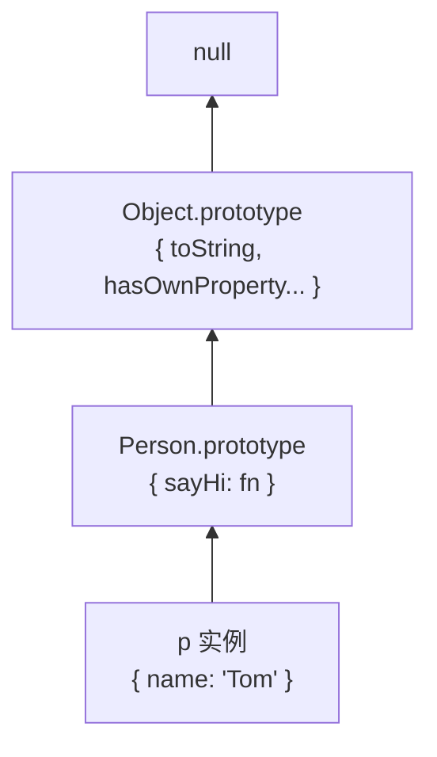

# 面向对象

::: tip
- 面向对象注重于**抽象事物**，面向过程注重于**叙述步骤**。
- 面向对象逻辑清晰有条理，面向过程在简单场景下更直接。
- JS 通过**函数 + 原型**模拟传统 OOP 中的「类」，实现封装、继承、多态。
:::

## 1. 封装

把数据和方法包装在一起，对外隐藏实现细节。

```js
function CreateObject(name) {
  // CreateObject 为构造函数
  this.name = name;
  this.eat = function () {
    console.log(this.name + " eat something");
  };
}
const objA = new CreateObject("A");
const objB = new CreateObject("B");
```

::: warning 注意
在构造函数里直接给实例挂方法（`this.eat = function`），每个实例都会有一份独立副本，浪费内存。公用方法应放在 `prototype` 上。
:::

### new 做了哪些操作

```js
/*
 1. 创建一个空对象
 2. 将构造函数的 prototype 赋值给新对象的 __proto__
 3. 将构造函数的 this 绑定到新对象
 4. 执行构造函数体内的代码
 5. 若构造函数没有返回对象，则返回新对象
*/

function ObjectTest(name) {
  this.name = name;
}

const objectA = new ObjectTest("A");
console.log(objectA.name); // A

// 手动模拟 new
const objectB = (function () {
  const obj = {};
  Object.setPrototypeOf(obj, ObjectTest.prototype);
  ObjectTest.call(obj, "B");
  return obj;
})();

console.log(objectB.name); // B
```

## 2. 原型与原型链

::: tip
- 每个**函数**在创建时会自动生成 `prototype` 属性（原型对象），一般存放实例共享的方法。
- 每个**对象**都有内部原型（可通过 `Object.getPrototypeOf(obj)` 访问，即 `[[Prototype]]`）。
- 访问属性时：先在对象自身找，没有则沿原型链向上，直到 `null` 为止。
:::

```js
function Person(name) {
  this.name = name;
}
Person.prototype.sayHi = function () {
  console.log(`Hi, ${this.name}`);
};

const p = new Person("Tom");

p.sayHi();                        // Hi, Tom
console.log(p.hasOwnProperty("name"));   // true（实例自身属性）
console.log(p.hasOwnProperty("sayHi")); // false（在原型上）
console.log(p instanceof Person);        // true
```

### 常用 API

```js
Object.getPrototypeOf(obj);           // 获取原型
Object.setPrototypeOf(obj, proto);    // 设置原型（性能较差，慎用）
Object.create(proto);                 // 以指定原型创建对象
obj.hasOwnProperty("key");            // 是否为自身属性
"key" in obj;                         // 自身或原型链上是否存在
```

## 3. 继承

JS 中继承的本质：**让子类的原型链连接到父类的原型**。

### 继承方式对比

| 方式 | 继承实例属性 | 继承原型方法 | 调用父构造 | 主要问题 |
|:-----|:------------|:------------|:----------|:---------|
| 类式继承 | ✓（共享引用） | ✓ | 不支持传参 | 引用类型被所有实例共享 |
| 构造函数继承 | ✓（各自独立） | ✗ | ✓ | 无法继承原型方法 |
| 组合式继承 | ✓ | ✓ | ✓ | 父构造执行两次 |
| 寄生组合式 | ✓ | ✓ | ✓ | 推荐写法 |
| ES6 class | ✓ | ✓ | ✓ | 语法糖，底层仍是原型 |

### 1. 类式继承

```js
function A(name) {
  this.name = name;
  this.list = [1, 2, 3];
}
A.prototype.getName = function () {
  console.log(this.name);
};

function SubA(name) {
  this.subName = "sub" + name;
}
SubA.prototype = new A(); // 子类原型 = 父类实例

const sa1 = new SubA("sa1");
console.log(sa1.list); // [1,2,3]（来自父类实例，所有子实例共享）
console.log(sa1.name); // undefined（父构造未以 sa1 为 this 执行）

/*
 * 问题：
 * 1. 无法向父构造函数传参（new A() 时 name 为 undefined）
 * 2. 父类实例属性变成子类原型上的共享属性，引用类型会互相污染
 */
```

### 2. 构造函数继承

```js
function A(name) {
  this.name = name;
  this.list = [1, 2, 3];
}
A.prototype.getName = function () {
  console.log(this.name);
};

function SubA(name) {
  A.call(this, name); // 在子实例上执行父构造
  this.subName = "sub" + this.name;
}

const sa1 = new SubA("xiaoA");
console.log(sa1.name, sa1.subName); // xiaoA subxiaoA
sa1.getName(); // 报错：原型链上没有 getName

// 问题：只能继承实例属性，继承不到 A.prototype 上的方法
```

### 3. 组合式继承

```js
function A(name) {
  this.name = name;
  this.list = [1, 2, 3];
}
A.prototype.getName = function () {
  console.log(this.name);
};

function SubA(name) {
  A.call(this, name);           // 第 1 次：继承实例属性
  this.subName = "sub" + this.name;
}
SubA.prototype = new A();       // 第 2 次：继承原型方法
SubA.prototype.constructor = SubA;

const sa1 = new SubA("xiaoA");
console.log(sa1.name, sa1.subName); // xiaoA subxiaoA
sa1.getName(); // xiaoA

/*
 * 小问题：
 * 1. 子类原型上多了一份无用的父类实例属性（name、list）
 * 2. 父构造函数执行了两次
 */
```

### 4. 寄生组合式继承（推荐）

只继承父类原型，不通过 `new A()` 产生多余实例属性：

```js
function A(name) {
  this.name = name;
  this.list = [1, 2, 3];
}
A.prototype.getName = function () {
  console.log(this.name);
};

function SubA(name) {
  A.call(this, name);
  this.subName = "sub" + this.name;
}

function inheritPrototype(subClass, superClass) {
  const F = function () {};
  F.prototype = superClass.prototype;  // 中间空函数，避免修改父类 prototype
  subClass.prototype = new F();
  subClass.prototype.constructor = subClass;
}

inheritPrototype(SubA, A);

const sa1 = new SubA("xiaoA");
console.log(sa1.name, sa1.subName); // xiaoA subxiaoA
sa1.getName(); // xiaoA
```

ES6 等价写法见下文 **class extends**。

### 5. Object.create 继承

```js
const animal = {
  eat() {
    console.log("eating");
  },
};

const dog = Object.create(animal);
dog.bark = function () {
  console.log("woof");
};

dog.eat();  // eating（沿原型链找到）
dog.bark(); // woof
```

## 4. ES6 Class

`class` 是构造函数的语法糖，底层仍是原型继承。

```js
class Animal {
  constructor(name) {
    this.name = name;
  }
  speak() {
    console.log(`${this.name} makes a sound`);
  }
  static create(name) {
    return new Animal(name);
  }
}

class Dog extends Animal {
  constructor(name, breed) {
    super(name); // 必须先调 super，才能用 this
    this.breed = breed;
  }
  speak() {
    console.log(`${this.name} barks`);
  }
}

const d = new Dog("Rex", "lab");
d.speak();                    // Rex barks（多态：覆盖父方法）
console.log(d instanceof Dog);  // true
console.log(d instanceof Animal); // true
```

### 私有字段与 getter / setter

```js
class Account {
  #balance = 0; // 私有字段，类外不可访问

  get balance() {
    return this.#balance;
  }

  deposit(amount) {
    this.#balance += amount;
  }
}

const acc = new Account();
acc.deposit(100);
console.log(acc.balance); // 100
// console.log(acc.#balance); // SyntaxError
```

### 属性描述符

```js
const obj = {};
Object.defineProperty(obj, "name", {
  value: "Tom",
  writable: false,   // 不可改
  enumerable: true,  // 可被 for...in 遍历
  configurable: false, // 不可删除、不可再改描述符
});

obj.name = "Jerry";
console.log(obj.name); // Tom
```

## 5. 多态

不同对象调用**同名方法**产生**不同结果**。

```js
function Base() {}

Base.prototype.initial = function () {
  this.init();
};

function SubA() {
  this.init = function () {
    console.log("SubA init");
  };
}

function SubB() {
  this.init = function () {
    console.log("SubB init");
  };
}

SubA.prototype = new Base();
SubB.prototype = new Base();

const subA = new SubA();
const subB = new SubB();

subA.initial(); // SubA init
subB.initial(); // SubB init
```

class 中的多态即**方法重写（override）**：

```js
class Shape {
  area() {
    return 0;
  }
}

class Circle extends Shape {
  constructor(r) {
    super();
    this.r = r;
  }
  area() {
    return Math.PI * this.r ** 2;
  }
}

class Rect extends Shape {
  constructor(w, h) {
    super();
    this.w = w;
    this.h = h;
  }
  area() {
    return this.w * this.h;
  }
}

[new Circle(2), new Rect(3, 4)].forEach((s) => console.log(s.area()));
// 12.566...  12
```

## 6. 原型链图解

以 `const p = new Person("Tom")` 为例，属性查找路径如下：



查找 `p.sayHi` 的过程：

1. `p` 自身有 `sayHi` 吗？→ 没有
2. 沿 `[[Prototype]]` 到 `Person.prototype` → 找到，调用
3. 若找 `p.toString`，继续向上到 `Object.prototype`
4. 到 `null` 仍未找到 → 返回 `undefined`

```js
function Person(name) {
  this.name = name;
}
Person.prototype.sayHi = function () {
  console.log(this.name);
};

const p = new Person("Tom");

// 三者的关系
console.log(p.__proto__ === Person.prototype);                    // true
console.log(Person.prototype.__proto__ === Object.prototype);   // true
console.log(Person.prototype.constructor === Person);           // true
```

::: tip 两个 prototype 不要混淆
- **`函数.prototype`**：显式属性，指向原型对象，只有函数才有。
- **`对象.__proto__`**：隐式链接（`[[Prototype]]`），指向创建该对象时使用的原型。推荐用 `Object.getPrototypeOf()` 访问。
:::

### 手写 instanceof

`instanceof` 本质是沿对象的 `[[Prototype]]` 链，看能否碰到构造函数的 `prototype`：

```js
function myInstanceof(obj, Constructor) {
  let proto = Object.getPrototypeOf(obj);
  while (proto !== null) {
    if (proto === Constructor.prototype) return true;
    proto = Object.getPrototypeOf(proto);
  }
  return false;
}

console.log(myInstanceof([], Array));  // true
console.log(myInstanceof([], Object)); // true（数组原型链最终连到 Object）
```

## 7. 组合优于继承

继承适合 **is-a**（是一个）关系，如 `Dog extends Animal`。  
组合适合 **has-a**（有一个）关系，如「汽车有一个引擎」，更灵活、耦合更低。

### 继承的问题

```js
class Bird {
  fly() {
    console.log("flying");
  }
}

class Penguin extends Bird {
  fly() {
    throw new Error("企鹅不会飞"); // 为了修正父类行为而覆盖，说明继承层次不合理
  }
}
```

深层继承会带来：

- 父类改动影响所有子类
- 子类被迫实现不需要的方法
- 多重继承在 JS 中难以优雅实现

### 组合：按能力拼装

```js
const canFly = {
  fly() {
    console.log("flying");
  },
};

const canSwim = {
  swim() {
    console.log("swimming");
  },
};

function createDuck(name) {
  return {
    name,
    ...canFly,
    ...canSwim,
  };
}

const duck = createDuck("Donald");
duck.fly();  // flying
duck.swim(); // swimming
```

class 中通过**成员组合**而非继承：

```js
class Car {
  constructor() {
    this.engine = new Engine();
    this.gps = new GPS();
  }
  start() {
    this.engine.ignite();
    this.gps.sync();
  }
}
```

### Mixin（混入）

把多个对象的属性和方法「混入」到目标对象或类的原型上：

```js
// 对象 Mixin
function mixin(target, ...sources) {
  Object.assign(target, ...sources);
  return target;
}

const serializable = {
  serialize() {
    return JSON.stringify(this);
  },
};

const loggable = {
  log() {
    console.log(this.serialize());
  },
};

function createUser(name) {
  return mixin({ name }, serializable, loggable);
}

createUser("Tom").log(); // {"name":"Tom"}
```

```js
// class Mixin（高阶函数包装）
function Serializable(Base) {
  return class extends Base {
    serialize() {
      return JSON.stringify(this);
    }
  };
}

function Loggable(Base) {
  return class extends Base {
    log() {
      console.log(JSON.stringify(this));
    }
  };
}

class User {
  constructor(name) {
    this.name = name;
  }
}

class Admin extends Loggable(Serializable(User)) {}

const admin = new Admin("root");
admin.log(); // {"name":"root"}
```

::: info 何时用继承，何时用组合
| 场景 | 推荐 |
|:-----|:-----|
| 明确的父子类型（`Dog is Animal`） | 继承 `extends` |
| 需要多种独立能力（飞、游、序列化） | 组合 / Mixin |
| 深层继承超过 2～3 层 | 考虑拆成组合 |
| React 组件复用逻辑 | Hooks（组合），而非 HOC 层层嵌套 |
:::

## 8. 速查

| 概念 | 说明 |
|:-----|:-----|
| `prototype` | 函数的原型对象，实例共享方法的载体 |
| `__proto__` / `[[Prototype]]` | 对象指向其原型的链接，用 `getPrototypeOf` 访问 |
| `new` | 创建对象 → 链原型 → 绑定 this → 执行构造 → 返回 |
| `call` 继承 | 在子构造中 `Parent.call(this, args)` 继承实例属性 |
| 原型继承 | `Child.prototype = Object.create(Parent.prototype)` |
| `class extends` | 语法糖，等价寄生组合式继承 |
| `super` | 子类中调用父类构造或方法 |
| `instanceof` | 检查对象是否在构造函数的 prototype 链上 |
| 原型链 | 对象 → prototype → ... → Object.prototype → null |
| Mixin | `Object.assign` 或高阶 class 混入多个能力 |
| 组合优于继承 | 用 has-a 拼装能力，避免为修正父类而大量 override |
