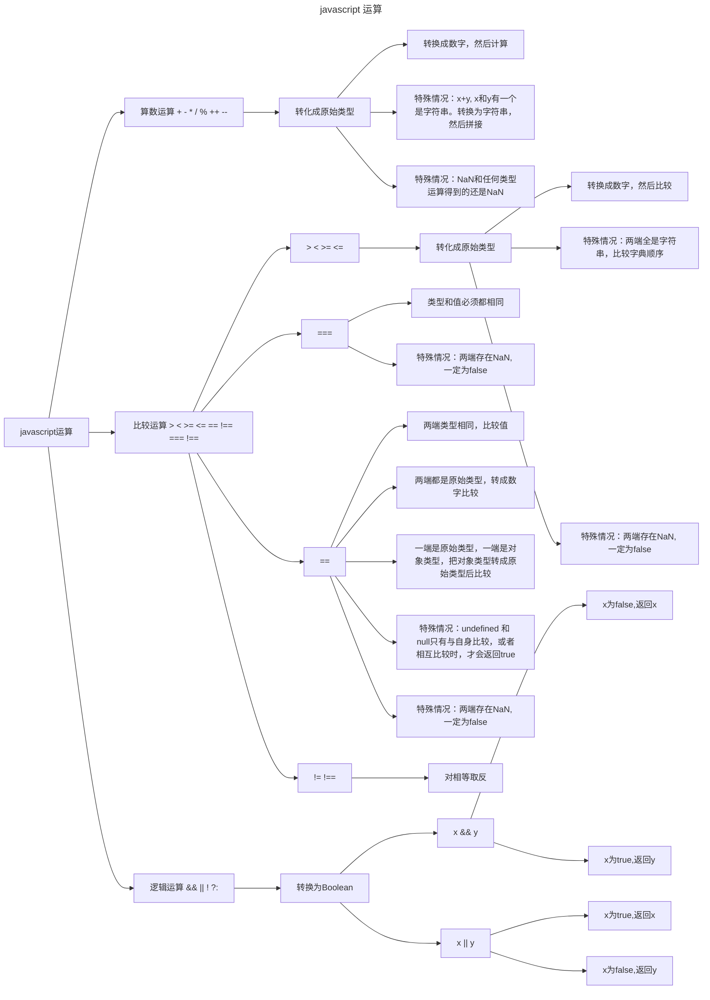

# JavaScript 杂项

## js 运算符

- `??` 逻辑运算符，当左侧的操作数为 `null` 和 `undefined` 时，返回其右侧操作数，否则返回左侧操作数

``` js
const bar = null ?? 1 // 1 
const bar = undefined ?? 1 // 1 
const bar = 0 ?? 1 // 0 
```

- `||` 逻辑运算符，当左侧的操作数为 `false` 时，返回其右侧操作数，否则返回左侧操作数;能够转化为false 的表达式 `null` 、`NaN` 、 `0` 、 `空字符串` 、 `undefined`

``` js
const bar = null || 1 // 1 
const bar = undefined || 1 // 1 
const bar = 0 || 1 // 1 
```

## javascript 运算



## 数字格式化

```js
const str = '10000000000.3782'
// 1,000,000,000,000.3,782
const num = str.replace(/\B(?=(\d{3})+(?!\d))/g, ',')
console.log(num) //  10,000,000,000.3,782
```

## 数字转中文

::: normal-demo 数字转中文

```html
<div class="title">中文统计金额</div>
<input type="number" id="num" value="888888.6666"/>
<p id="very"></p>
<p id="veryBig"></p>

<div class="title">数字转中文</div>

<p id="very1"></p>
<p id="veryBig1"></p>
```

```js
document.querySelector("#num").oninput = () => {
    initNum()
}
initNum()

function initNum() {
    let num = document.querySelector("#num").value
    document.querySelector("#very").innerHTML = numToChinese(num, true)
    document.querySelector("#veryBig").innerHTML = numToBigChinese(num, true)
    document.querySelector("#very1").innerHTML = numToChinese(num)
    document.querySelector("#veryBig1").innerHTML = numToBigChinese(num)
}

function numToChinese(num, type) {
    let chineseNum = ''
    let chinesePoint = ''
    let point = ''
    let temp = num.replace(/\B(?=(\d{4})+(?!\d))/g, ',').split(',').filter(Boolean)
    if (num.indexOf('.') !== -1){
        temp = num.split('.')[0].replace(/\B(?=(\d{4})+(?!\d))/g, ',').split(',').filter(Boolean)
        point = num.split('.')[1]
    }
    
    const map = ["零",'一','二','三','四','五','六','七','八','九'];
    const units = ['','十','百','千']
    // 处理小数点
    function _setChinesePoint(p) {
        if (!type) {
            return '点' + p.split('').map(n => map[n]).join('') 
        }
        const pointUnits = ['角','分','毫','厘']
        for (let i = 0; i < p.slice(0, 4).length; i++) {
            const c = map[p[i]]
            let u = pointUnits[i]
            if (c === '零') {
                u =''
            }
            chinesePoint += c + u
        }
        chinesePoint = _removeZero(chinesePoint)
        return '元' + chinesePoint
    }
    // 删除多余的零
    function _removeZero(n) {
        return n.replace(/零+/, '零').replace(/零$/, '')
    }
    // 转换成中文
    function _transformChinese(n) {
        let result = '';
        for (let i = 0; i < n.length; i++) {
            const c = map[n[i]]
            let u = units[n.length -i - 1]
            if (c === '零') {
                u = ''
            }
            result += c + u
        }
        result = _removeZero(result)
        return result
    }
    const bigUnit = ['','万','亿','万亿','亿亿','万亿亿']
    // 循环添加单位
    for (let i = 0; i < temp.length; i++) {
        const p = temp[i];
        let c =  _transformChinese(p)
        if (c === '') {
            chineseNum = '零'
            continue;
        }
        const u = bigUnit[temp.length - i - 1]
        chineseNum += c + u
    }
    chineseNum = _removeZero(chineseNum)
    if (point) {
     chineseNum += _setChinesePoint(point)
    }
    return chineseNum
}

function numToBigChinese(num, type) {
    const cnum = numToChinese(num, type)
    let map = {
        "零": "零",
        "一": "壹",
        "二": "贰",
        "三": "叁",
        "四": "肆",
        "五": "伍",
        "六": "陆",
        "七": "柒",
        "八": "捌",
        "九": "玖",
        "十": "拾",
        "百": "佰",
        "千": "仟",
        "万": "萬",
        "亿": "億",
        "点": "點",
        "元": "元",
        "角": "角",
        "分": "分",
        "毫": "毫",
        "厘": "厘"
    }
    return cnum.split('').map((item) => map[item]).join('')
}

```

```css
.title{
    font-size: 20px;
    margin-bottom: 20px;
    font-weight: bold;
    color: #2196f3;
}
#num {
    width: 200px;
    height: 30px;
    border: 1px solid #ccc;
    border-radius: 10px;
    font-size: 20px;
    padding-left: 10px;
}
p{
    font-size: 20px;
    font-weight: bold;
}
#num:focus {
    border: 1px solid #2196f3;
}
#num[type=number]::-webkit-inner-spin-button, 
#num[type=number]::-webkit-outer-spin-button { 
  -webkit-appearance: none;
  margin: 0; 
}
#num[type=number] {
    -moz-appearance:textfield;
}
```

:::

## let,const

- let 声明的变量只在let命令所在的代码块内有效
- const 声明一个只读的常量，一旦声明，常量的值不能改变

:::info var, let

- 使用var关键字声明的全局作用域变量属于 window对象；
- 使用let关键字声明的全局作用域变量不属于window 对象；
- var 关键字定义的变量可以使用后声明，也就是变量可以先使用在声明（变量提升）
- let 关键字定义的变量不可以在使用后声明，也就是变量需要先声明再使用
- const 用于声明一个或多个常量，声明时必须进行初始化，切初始化后值不可在修改；

:::

## JavaScript 精确度问题

- JavaScript中数字是使用64位双精度浮点型来表示的， 精度问题都是由于浮点数无法精确表示引起的
- 目前比较成熟的库，比如 [bignumber.js](https://github.com/MikeMcl/bignumber.js)，[decimal.js](https://github.com/MikeMcl/decimal.js)，以及[big.js](https://github.com/MikeMcl/big.js)等

## 变量提升

JavaScript在执行之前会有一个 `预编译` 过程，变量提升和函数提升就在这时候发生。[具体介绍](https://www.runoob.com/js/js-hoisting.html)

:::info 变量提升

- javaScript中，函数及变量的声明都会被提升到函数的最顶部；
- javaScript中，变量可以在使用后声明，也就是变量可以先使用在声明；
- JavaScript 初始化不会提升，只有声明的变量会提升；
- JavaScript中，函数声明比变量提升先，就是说，先函数提升，在变量提升。
- JavaScript中，变量的搜索顺序：找变量时，先找局部变量，如果没有局部变量；再找全局变量；

:::

## 防抖&节流

优化高频率执行代码的一种手段，可以防止函数被多次调用。

::: tip 区别

1、相同点

- 防抖和节流都是为了防止函数被多次调用，降低回调执行频率，减少资源消耗。
- 都可以通过setTimeout() 来实现，通过定时器来控制函数的执行频率。

2、不同点

- 防抖，在一段连续操作结束后，处理回调，利用clearTimeout() 来清除定时器，避免重复执行回调。节流在一段连续操作中，每一段时间只执行一次，  
频率较高的事件中使用来提高性能
- 防抖关注一定时间连续触发的事件，只在最后执行一次，而节流一段时间内只执行一次；

:::

::: tip 应用场景

1、防抖只触发一次场景

- 搜索框输入搜索，只需用户最后一次输入玩，在发送搜索请求
- 手机号，邮箱输入校验
- 窗口大小 `resize`。只需要窗口调整完成后，计算窗口大小，防止重复渲染；

2、节流间隔一段时间执行一次的场景

- 滚动加载，加载更多或滚动到底部监听
- 搜索框，搜索联想功能

:::

### 防抖

::: tip 定义
防抖: n 秒后在执行该事件，若在 n 秒内被重复触发，则重新计时间
:::

简单实现

```js
function debounce(func, wait) {
    let timeout;
    return function () {
        let context = this; // 保存this指向
        let args = arguments; // 拿到event对象

        clearTimeout(timeout)
        timeout = setTimeout(function(){
            func.apply(context, args)
        }, wait);
    }
}
```

需要立即执行

```js
function debounce(func, wait, immediate) {
    let timeout;
    return function () {
        let context = this; // 保存this指向
        let args = arguments; // 拿到event对象
        if (timeout) clearTimeout(timeout)
        if (immediate) {
            let callNow = immediate && !timeout;
            timeout = setTimeout(function(){
                timeout = null
            }, wait)
            if (callNow) func.apply(context, args)
        }else {
            timeout = setTimeout(function(){
                func.apply(context, args)
            }, wait)
        }
    }
}
```

### 节流

::: tip 定义
节流: n 秒内只运行一次，若在 n 秒内重复触发，只有一次生效
:::

使用时间戳写法，事件会立即执行，停止触发后没有办法再次执行

```js
function throttle(func, wait) {
    let oldTime = Date.now();
    return function (...args) {
        let nowTime = Date.now();
        if (nowTime - oldTime > wait) {
            func.apply(null, args)
            oldTime = Date.now()
        }
    }
}
```

使用定时器写法，事件不会立即执行，停止触发后可以再次执行

```js
function throttle(fn, delay = 500) {
    let timer = null
    return function (...args) {
        if (!timer) {
            timer = setTimeout(() => {
                fn.apply(this, args)
                timer = null
            }, delay);
        }
    }
}
```

两者结合

```js
function throttle(fn, delay) {
    let timer = null
    let starttime = Date.now()
    return function () {
        let curTime = Date.now() // 当前时间
        let remaining = delay - (curTime - starttime)  // 从上一次到现在，还剩下多少多余时间
        let context = this
        let args = arguments
        clearTimeout(timer)
        if (remaining <= 0) {
            fn.apply(context, args)
            starttime = Date.now()
        } else {
            timer = setTimeout(fn, remaining);
        }
    }
}
```

## 垃圾回收

### 1.标记清除

`“标记清除”` 是目前主流的垃圾收集算法，这种算法的思想就是给当前不使用的值加上标记，然后再回收其内存

### 2.引用计数

`“引用计数”`跟踪记录所有值被引用的次数
（注： `JavaScript`引擎目前都不在使用这种算法，当代码中存在循环引用现象时，`‘引用计数’`算法会导致问题）

### 3.优化

解除变量的引用不仅有助于消除循环引用现象，而且对垃圾收集也有好处。为了确保有效地回收内存，应该
及时解除不再使用的全局对象，全局对象属性以及循环引用变量的引用。

### 4.小计

函数内的变量在函数执行完之后，变量所占内存就会释放
