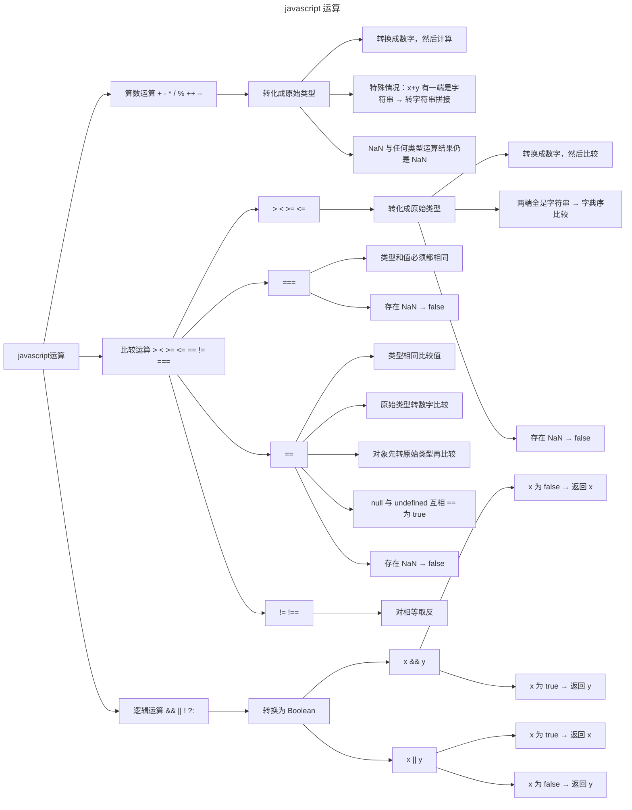

# JavaScript 杂项

本文整理 JS 中零散但常用的知识点：运算符、类型转换、变量声明、精度、防抖节流、垃圾回收等。`this`、面向对象、事件循环、设计模式见同目录其他文档。

## 1. 运算符

### 空值合并 `??` 与逻辑或 `||`

| 运算符 | 左侧为假时返回右侧 | 「假值」范围 |
|:-------|:-------------------|:-------------|
| `??` | 仅 `null`、`undefined` | 不含 `0`、`''`、`false` |
| `\|\|` | 所有假值 | `null`、`undefined`、`0`、`''`、`false`、`NaN` |

```js
null ?? 1        // 1
undefined ?? 1   // 1
0 ?? 1           // 0（0 不是 nullish）

null || 1        // 1
0 || 1           // 1（0 是假值）
'' || 'default'  // 'default'
```

### 可选链 `?.`

安全访问深层属性，遇 `null` / `undefined` 短路返回 `undefined`，不抛错：

```js
const user = { profile: { name: "Tom" } };

user?.profile?.name;     // Tom
user?.address?.city;     // undefined
user?.getName?.();       // 方法可选调用

// 与 ?? 配合设置默认值
const city = user?.address?.city ?? "未知";
```

### 逻辑赋值

```js
let a = null;
a ??= 1;   // a = 1，仅 null/undefined 时赋值

let b = 0;
b ||= 2;   // b = 2

let c = 1;
c &&= 0;   // c = 0
```

### 运算符总览


```mermaid
---
title: javascript 运算
---
%%{init: {"flowchart": {"htmlLabels": false}} }%%
flowchart LR
   javascript运算 --> 1[算数运算 + - * / % ++ --] & 2["`比较运算 > < >= <= == != ===`"] & 3["`逻辑运算 && || ! ?:`"]
   1 --> 1.0[转化成原始类型] --> 1.1[转换成数字，然后计算] & 1.2["`特殊情况：x+y 有一端是字符串 → 转字符串拼接`"] & 1.3["`NaN 与任何类型运算结果仍是 NaN`"]
   2 --> a["`> < >= <=`"] --> 2.0[转化成原始类型] --> 2.1[转换成数字，然后比较] & 2.2["`两端全是字符串 → 字典序比较`"] & 2.3["`存在 NaN → false`"]
   2 --> b["`===`"] --> b.1[类型和值必须都相同] & b.2["`存在 NaN → false`"]
   2 --> c["`==`"] --> c.1[类型相同比较值] & c.2[原始类型转数字比较] & c.3[对象先转原始类型再比较] & c.4["`null 与 undefined 互相 == 为 true`"] & c.5["`存在 NaN → false`"]
   2 --> d["`!= !==`"] --> d.1["`对相等取反`"]
   3 --> 3.0[转换为 Boolean] --> e.1["`x && y`"] --> e.1.1["x 为 false → 返回 x"] & e.1.2["x 为 true → 返回 y"]
   3.0 --> f.1["`x || y`"] --> f.1.1["x 为 true → 返回 x"] & f.1.2["x 为 false → 返回 y"]
```

## 2. 类型转换

### 原始类型与引用类型

| 类型 | 示例 | 存储 |
|:-----|:-----|:-----|
| `number` | `42`, `NaN` | 栈（值） |
| `string` | `'hi'` | 栈 |
| `boolean` | `true` | 栈 |
| `undefined` | `undefined` | 栈 |
| `null` | `null` | 栈 |
| `symbol` | `Symbol()` | 栈 |
| `bigint` | `1n` | 栈 |
| `object` | `{}`, `[]` | 栈存引用，堆存对象 |

### 显式与隐式转换

```js
Number("42");    // 42
Number("");      // 0
Number("abc");   // NaN

String(123);     // "123"
Boolean(0);      // false
Boolean("0");    // true（非空字符串为真）

// 隐式：== 、 + 、 if 条件等触发
"5" - 2;         // 3
"5" + 2;         // "52"
```

### typeof 与 instanceof

```js
typeof 42;           // "number"
typeof null;         // "object"（历史遗留 bug）
typeof [];           // "object"
Array.isArray([]);   // true（区分数组）

[] instanceof Array;  // true
```

## 3. 数字格式化

```js
const str = "10000000000.3782";
// 千分位：从右向左每 3 位加逗号
const formatted = str.replace(/\B(?=(\d{3})+(?!\d))/g, ",");
console.log(formatted); // 10,000,000,000.3782
```

内置 API：

```js
(1234567.89).toLocaleString("zh-CN"); // "1,234,567.89"
new Intl.NumberFormat("zh-CN").format(1234567.89);
```

## 4. 数字转中文

::: normal-demo 数字转中文

```html
<div class="title">中文统计金额</div>
<input type="number" id="num" value="888888.6666"/>
<p id="very"></p>
<p id="veryBig"></p>

<div class="title">数字转中文</div>

<p id="very1"></p>
<p id="veryBig1"></p>
```

```js
document.querySelector("#num").oninput = () => {
    initNum()
}
initNum()

function initNum() {
    let num = document.querySelector("#num").value
    document.querySelector("#very").innerHTML = numToChinese(num, true)
    document.querySelector("#veryBig").innerHTML = numToBigChinese(num, true)
    document.querySelector("#very1").innerHTML = numToChinese(num)
    document.querySelector("#veryBig1").innerHTML = numToBigChinese(num)
}

function numToChinese(num, type) {
    let chineseNum = ''
    let chinesePoint = ''
    let point = ''
    let temp = num.replace(/\B(?=(\d{4})+(?!\d))/g, ',').split(',').filter(Boolean)
    if (num.indexOf('.') !== -1){
        temp = num.split('.')[0].replace(/\B(?=(\d{4})+(?!\d))/g, ',').split(',').filter(Boolean)
        point = num.split('.')[1]
    }
    
    const map = ["零",'一','二','三','四','五','六','七','八','九'];
    const units = ['','十','百','千']
    function _setChinesePoint(p) {
        if (!type) {
            return '点' + p.split('').map(n => map[n]).join('') 
        }
        const pointUnits = ['角','分','毫','厘']
        for (let i = 0; i < p.slice(0, 4).length; i++) {
            const c = map[p[i]]
            let u = pointUnits[i]
            if (c === '零') {
                u =''
            }
            chinesePoint += c + u
        }
        chinesePoint = _removeZero(chinesePoint)
        return '元' + chinesePoint
    }
    function _removeZero(n) {
        return n.replace(/零+/, '零').replace(/零$/, '')
    }
    function _transformChinese(n) {
        let result = '';
        for (let i = 0; i < n.length; i++) {
            const c = map[n[i]]
            let u = units[n.length -i - 1]
            if (c === '零') {
                u = ''
            }
            result += c + u
        }
        result = _removeZero(result)
        return result
    }
    const bigUnit = ['','万','亿','万亿','亿亿','万亿亿']
    for (let i = 0; i < temp.length; i++) {
        const p = temp[i];
        let c =  _transformChinese(p)
        if (c === '') {
            chineseNum = '零'
            continue;
        }
        const u = bigUnit[temp.length - i - 1]
        chineseNum += c + u
    }
    chineseNum = _removeZero(chineseNum)
    if (point) {
     chineseNum += _setChinesePoint(point)
    }
    return chineseNum
}

function numToBigChinese(num, type) {
    const cnum = numToChinese(num, type)
    let map = {
        "零": "零",
        "一": "壹",
        "二": "贰",
        "三": "叁",
        "四": "肆",
        "五": "伍",
        "六": "陆",
        "七": "柒",
        "八": "捌",
        "九": "玖",
        "十": "拾",
        "百": "佰",
        "千": "仟",
        "万": "萬",
        "亿": "億",
        "点": "點",
        "元": "元",
        "角": "角",
        "分": "分",
        "毫": "毫",
        "厘": "厘"
    }
    return cnum.split('').map((item) => map[item]).join('')
}

```

```css
.title{
    font-size: 20px;
    margin-bottom: 20px;
    font-weight: bold;
    color: #2196f3;
}
#num {
    width: 200px;
    height: 30px;
    border: 1px solid #ccc;
    border-radius: 10px;
    font-size: 20px;
    padding-left: 10px;
}
p{
    font-size: 20px;
    font-weight: bold;
}
#num:focus {
    border: 1px solid #2196f3;
}
#num[type=number]::-webkit-inner-spin-button, 
#num[type=number]::-webkit-outer-spin-button { 
  -webkit-appearance: none;
  margin: 0; 
}
#num[type=number] {
    -moz-appearance:textfield;
}
```

:::

## 5. let、const 与 var

| | `var` | `let` | `const` |
|:--|:------|:------|:--------|
| 作用域 | 函数 | 块级 | 块级 |
| 变量提升 | 提升，初始化为 `undefined` | 提升但处于 TDZ | 同 `let` |
| 重复声明 | 允许 | 不允许 | 不允许 |
| 修改绑定 | 允许 | 允许 | 不允许（对象属性可改） |

```js
// 暂时性死区（TDZ）：声明前访问 let/const 会报错
console.log(a); // undefined（var 提升）
var a = 1;

// console.log(b); // ReferenceError
let b = 2;

const obj = { x: 1 };
obj.x = 2;       // 可以改属性
// obj = {};     // TypeError：不能改绑定
```

::: info var vs let
- `var` 声明的全局变量属于 `window`（浏览器）；`let` / `const` 不属于。
- `var` 可先使用后声明；`let` / `const` 必须先声明。
- `const` 声明时必须初始化，绑定不可再改。
:::

## 6. 精度问题

JavaScript 数字为 **IEEE 754 双精度浮点数**，部分十进制小数无法精确表示：

```js
0.1 + 0.2;              // 0.30000000000000004
(0.1 + 0.2) === 0.3;    // false

// 简单处理（展示用，非金融级）
(0.1 + 0.2).toFixed(1); // "0.3"
Number((0.1 + 0.2).toFixed(10)); // 0.3
```

金额计算推荐库：[bignumber.js](https://github.com/MikeMcl/bignumber.js)、[decimal.js](https://github.com/MikeMcl/decimal.js)、[big.js](https://github.com/MikeMcl/big.js)。

## 7. 变量提升

执行前有**预编译**阶段，声明会被提升（[详细介绍](https://www.runoob.com/js/js-hoisting.html)）。

```js
console.log(foo); // undefined（var 提升）
var foo = 1;

bar(); // "bar"（函数声明整体提升）
function bar() {
  console.log("bar");
}

console.log(baz); // undefined（var 提升的是变量，不是赋值）
var baz = function () {
  console.log("baz");
};
```

::: info 提升规则
- 只有**声明**提升，**赋值**不提升。
- **函数声明**优先于 **var** 提升。
- `let` / `const` 也会提升，但在声明前处于 TDZ，访问会报错。
- 找变量：当前作用域 → 外层作用域 → 全局。
:::

## 8. 深浅拷贝

```js
const original = { a: 1, b: { c: 2 }, d: [3] };

// 浅拷贝：只复制第一层
const shallow1 = { ...original };
const shallow2 = Object.assign({}, original);
shallow1.b.c = 99;
console.log(original.b.c); // 99（嵌套对象仍共享引用）

// 深拷贝
const deep1 = structuredClone(original); // 现代 API，推荐
const deep2 = JSON.parse(JSON.stringify(original)); // 简单场景，不支持 Date/函数/undefined
```

| 方法 | 深度 | 注意 |
|:-----|:-----|:-----|
| 展开 `...` / `Object.assign` | 浅 | 嵌套引用共享 |
| `structuredClone` | 深 | 不支持 DOM、部分内置对象 |
| `JSON` 序列化 | 深 | 丢失函数、`undefined`、循环引用报错 |

## 9. 防抖与节流

优化高频回调，降低执行次数。

::: tip 区别
**相同点**：都通过 `setTimeout` 等控制执行频率，减少资源消耗。

**不同点**：
- **防抖**：连续触发时只认最后一次，适合「输入结束再请求」。
- **节流**：固定时间窗口内最多执行一次，适合「滚动、拖拽」。
:::

::: tip 应用场景
**防抖**：搜索框输入、表单校验、`resize` 结束后布局计算。

**节流**：滚动加载、鼠标移动、按钮连点防护。
:::

### 防抖

n 秒后再执行；n 秒内再次触发则重新计时。

```js
function debounce(func, wait, immediate = false) {
  let timeout;
  return function (...args) {
    const context = this;
    clearTimeout(timeout);
    if (immediate) {
      const callNow = !timeout;
      timeout = setTimeout(() => { timeout = null; }, wait);
      if (callNow) func.apply(context, args);
    } else {
      timeout = setTimeout(() => func.apply(context, args), wait);
    }
  };
}
```

### 节流

n 秒内只执行一次。

**时间戳版**：首次立即执行，结束后无法 trailing 执行。

```js
function throttle(func, wait) {
  let last = 0;
  return function (...args) {
    const now = Date.now();
    if (now - last >= wait) {
      last = now;
      func.apply(this, args);
    }
  };
}
```

**定时器版**：首次延迟，停止触发后还能执行一次。

```js
function throttleTimer(fn, delay = 500) {
  let timer = null;
  return function (...args) {
    if (!timer) {
      timer = setTimeout(() => {
        fn.apply(this, args);
        timer = null;
      }, delay);
    }
  };
}
```

**结合版**：首击立即 + 停止后 trailing。

```js
function throttle(fn, delay) {
  let timer = null;
  let start = Date.now();
  return function (...args) {
    const remaining = delay - (Date.now() - start);
    clearTimeout(timer);
    if (remaining <= 0) {
      fn.apply(this, args);
      start = Date.now();
    } else {
      timer = setTimeout(() => {
        fn.apply(this, args);
        start = Date.now();
      }, remaining);
    }
  };
}
```

## 10. 严格模式

在文件或函数顶部加 `"use strict"`，启用更严格的语法与错误检查：

```js
"use strict";

// 禁止未声明变量赋值
// x = 1; // ReferenceError

// 禁止重复参数名
// function f(a, a) {} // SyntaxError

// 独立函数调用 this 为 undefined
function show() {
  console.log(this); // undefined（非严格模式为 global）
}
```

## 11. 模块化

| | CommonJS | ES Module |
|:--|:---------|:----------|
| 语法 | `require` / `module.exports` | `import` / `export` |
| 加载 | 运行时 | 编译时静态分析 |
| 值 | 拷贝导出值 |  live binding |
| 环境 | Node.js 传统 | 现代 Node + 浏览器 |

```js
// ESM
export const PI = 3.14;
export default function add(a, b) { return a + b; }

import add, { PI } from "./math.js";
```

## 12. 垃圾回收

JS 自动管理堆内存，开发者无法手动 `free`，但可通过解除引用帮助回收。

### 标记清除（Mark-Sweep）

目前主流算法：从根对象（全局、调用栈引用）出发标记可达对象，未标记的视为垃圾并回收。

### 引用计数（已淘汰）

记录值被引用次数，为 0 时回收。**循环引用**会导致内存泄漏，现代引擎不再单独使用。

```js
// 循环引用示例（标记清除可处理，但引用仍应主动断开）
let a = {};
let b = {};
a.ref = b;
b.ref = a;
a = null;
b = null; // 断开根引用，等待 GC
```

### 分代回收（V8 简述）

- **新生代**：存活时间短的对象，Scavenge 算法，复制存活对象。
- **老生代**：长期存活对象，标记清除 + 标记整理。

### 常见泄漏场景

- 未清理的定时器 / 事件监听
- 闭包持有大对象
- 脱离 DOM 的节点仍被 JS 引用
- 全局变量累积

```js
// 及时清理
const handler = () => { /* ... */ };
window.addEventListener("resize", handler);
// 组件销毁时：
window.removeEventListener("resize", handler);
```

::: info 小记
- 函数执行完，其局部变量一般可被回收（若无闭包引用）。
- 全局对象、闭包、DOM 引用是泄漏高发区，不再需要时置 `null` 或解除监听。
:::

## 13. 速查

| 主题 | 要点 |
|:-----|:-----|
| `??` vs `\|\|` | `??` 只认 null/undefined；`\|\|` 认所有假值 |
| `?.` | 安全访问属性/方法 |
| TDZ | `let`/`const` 声明前不可访问 |
| `0.1+0.2` | 浮点精度，金额用专用库 |
| 防抖 | 最后一次生效 |
| 节流 | 固定间隔生效 |
| 浅拷贝 | `...`、`Object.assign` |
| 深拷贝 | `structuredClone`、JSON |
| GC | 标记清除；断开无用引用 |
