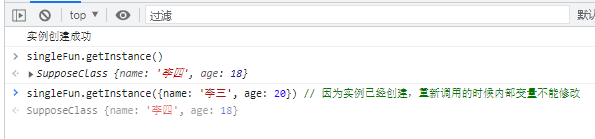
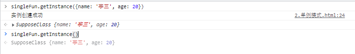

# 设计模式

## 单例模式

:::info
单例模式：保证一个类且只有一个实例，并提供一个访问它的全局访问点  
思路：利用js的作用域，形成闭包，从而可以创建私有变量（instance），然后将创建的实例赋予这个私有变量（instance）。每当想创建这个类的实例时，先判断私有变量（instance）是否已经引用了存在的实例
如果没有引用，即这个类没有实例，就创建一个实例，然后将其赋值给私有变量（instance）；如果已经引用。即已存在了该类的实例，就无需在创建，直接使用私有变量（instance）
:::

```js
let singleFun = (function() {
    let instance = null;
    function SupposeClass(args) {
        this.name = args?.name || '李四';
        this.age = args?.age || 18;
        // 单例模式检测，调用多次，只打印一次
        console.log('实例创建成功')
    }
    SupposeClass.prototype = {
        constructor: SupposeClass,
        getInfo: function() {
            console.log(`name：${this.name}, age:${this.age}`)
        }
    }
    return {
        name: 'SupposeClass',
        getInstance: function(args) {
            if(instance === null) {
                    instance = new SupposeClass(args)
            }
            return instance;
        }
    }
})()
singleFun.getInstance()
singleFun.getInstance()
```



第一次创建的时候传递参数，修改内部变量



## 工厂模式

```javascript
function objectFun(name, age, job) {
    let o = new Object();
    o.name = name;
    o.age = age;
    o.job = job;
    o.sayName = function () {
        console.log(this.name)
    }
    return o;
}
let objectOne = objectFun("张三", 12, "前端")
let objectTwo = objectFun("李四", 22, "后端")

objectOne.sayName() // "张三"
objectTwo.sayName() // "李四"
```

## 构造函数模式

```javascript
function Factory(name, age, job) {
    this.name = name;
    this.age = age;
    this.job = job;
    this.getName = function () {
        console.log(this.name)
    }
}
let factoryOne = new Factory('张三', 12, '前端')
let factoryTwo = new Factory('李四', 12, '后端')

factoryOne.getName() // 张三
factoryTwo.getName() // 李四

/*
* factoryOne = new Factory('张三', 12, '前端') -> {
*       name: '张三',
*       age: 12,
*       job: '前端',
*       getName: fn()
*       __proto__: Factory.prototype
* }
* factoryOne = new Factory('李四', 12, '李四') -> {
*       name: '李四',
*       age: 12,
*       job: '李四',
*       getName: fn()
*       __proto__: Factory.prototype
* }
* 
* */
```

:::tip 注
1.没有显式地创建对象；  
2.直接将属性和方法赋给了this对象；  
3.没有return语句。  
(构造函数始终都应该以一个大写字母开头，而非构造函数则应该以一个小写字母开头。)  
(1) 创建一个新对象；  
(2)将构造函数的作用域赋给新对象（因此this就指向了这个新对象）；  
(3)执行构造函数中的代码（为这个新对象添加属性）；  
(4)返回新对象。  
(factoryOne 和 factoryTwo 分别保存这 Factory的一个不同的实例。这两个对象都有一个constructor（构造函数）属性，该属性指向Factory)
:::

## 原型模式

```javascript
function Person(name){
    this.name = name
}
Person.prototype.name = "lisi"
Person.prototype.age = 12
Person.prototype.sayName = function (){
    console.log(this.name);
}
let person1 = new Person('张三');
person1.sayName() 

/*
* person1 = new Person() -> {
*       name: '张三',
*       __proto__: {
*           name: 'lisi',
*           age: 12,
*           sayName: fn()
*       }
*   }
*   
* */

```

## 组合使用构造函数模式和原型模式

```javascript
function Person(name, age, job) {
    this.name = name;
    this.age = age;
    this.job = job;
    this.friends = [1, 2]
}
Person.prototype = {
    constructor: Person,
    sayName: function () {
        console.log(this.name);
    }
}
```

## 动态原型模式

```javascript
function Person(name, age, job) {
    this.name = name;
    this.age = age;
    this.job = job
    
    if (typeof this.sayName != 'function') {
        Person.prototype.sayName = function () {
            console.log(this.name);
        }
    }
}
```

## 链模式

::: tip
链模式是实现链式调用的主要方法，通过在自身方法中返回自身的方式，在一个对象连续多次调用自身方法是可以简化写法。
这种链式调用在在开发多库和框架如jquery/zepto 中频繁被使用
:::

```javascript

let obj = {
    a: function () {
        console.log('aaa')
        return this
    },
    b: function (){
    console.log('bbb')
        return this
    }
}

obj.a().b() // aaa  bbb
```

## 委托模式

::: tip
当多个对象要处理同一请求时，可以将这些请求交由另一个对象统一处理 (事件代理)
:::

```js

```

## 数据访问对象模式

::: tip

- 数据访问对象模式主要是用来抽象和封装一个对象来对数据源进行访问和储存，这样可以方便对数据的管理，以及避免数据间的重复，覆盖等问题出现。

:::

## 等待者模式

::: tip

- 通过对多个异步进程的监听，对未来事件进行统一管理

:::

## MVC模式

::: tip

- MVC是由三个单词的首字符组成的：分别是模型model、 视图view、 控制器controller
- 他是一种是使用业务逻辑，数据，视图进行分离的方式来组织架构代码的一种模式

:::

```js
 var MVC = {}
    MVC.model = (function() {
        var data = {
            side:[{
                title: 'side1',
                url: './a.html'
            },{
                title: 'side2',
                url: './b.html'
            },{
                title: 'side3',
                url: './c.html'
            },]
        }
        return {
            getData(key) {
                return data[key];
            },
            setData(key, value){
                data[key] = value
                MVC.view('createHtml')
            }
        }
    })()

    MVC.view = (function(){
        var m = MVC.model
        var view = {
            createHtml: function() {
                var list = m.getData('side')
                var html = "<ul>";
                for(var i = 0; i< list.length; i++) {
                    html += "<li><a href='"+ list[i].url +"'>"+ list[i].title +"</a></li>"
                }
                html +='</ul>';
                document.querySelector('body').innerHTML = html;
            }
        }
        return function(v){
            view[v]()
        };
    })()
    MVC.ctrl = (function(){
        var v = MVC.view
        var m = MVC.model
        var c = {
            init: function() {
                v('createHtml')
            },
            updateHtml() {
                m.setData('side', [{title: 'new Side', url: './adf.html'}])
            }
        }
        return c;
    })()
    window.onload=function() {
        MVC.ctrl.init()
        setTimeout(function() {
            MVC.ctrl.updateHtml()
        }, 3000)
    }
```
