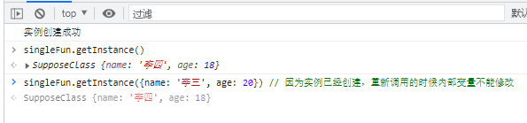
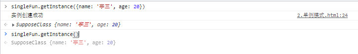
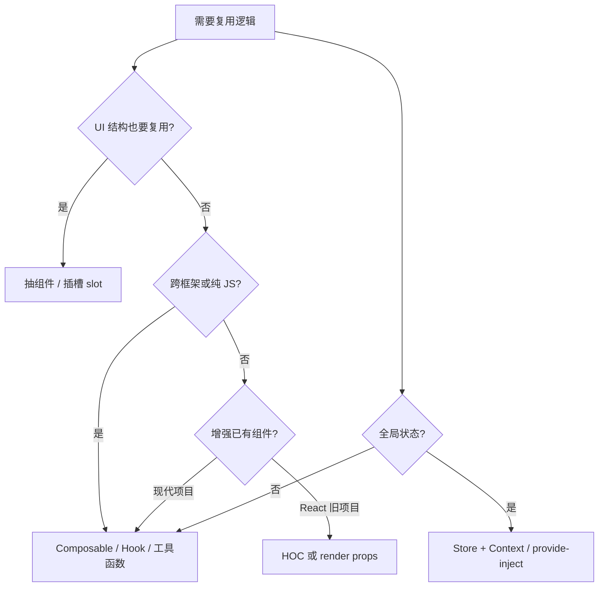

# 设计模式

设计模式是面向对象开发中**可复用的解决方案**。JS 中常用创建型、结构型、行为型三类模式；下面结合典型场景与代码说明。

## 模式分类速览

| 类型 | 模式 | 核心意图 |
|:-----|:-----|:---------|
| 创建型 | 单例、工厂、构造函数、原型 | 控制对象创建方式 |
| 结构型 | 代理、装饰器、适配器、DAO | 组织对象组合与访问 |
| 行为型 | 观察者、发布订阅、策略、命令、委托、链式 | 对象间通信与职责分配 |
| 架构 | MVC、MVVM | 分层组织业务与视图 |

---

## 创建型模式

### 单例模式

保证一个类**只有一个实例**，并提供全局访问点。

::: info
利用闭包保存私有变量 `instance`，首次调用时创建，之后直接返回同一实例。
:::

```js
const singleFun = (function () {
  let instance = null;
  function SupposeClass(args) {
    this.name = args?.name || "李四";
    this.age = args?.age || 18;
    console.log("实例创建成功");
  }
  SupposeClass.prototype = {
    constructor: SupposeClass,
    getInfo() {
      console.log(`name：${this.name}, age:${this.age}`);
    },
  };
  return {
    name: "SupposeClass",
    getInstance(args) {
      if (instance === null) {
        instance = new SupposeClass(args);
      }
      return instance;
    },
  };
})();

singleFun.getInstance();
singleFun.getInstance(); // 不会再次创建
```



第一次创建时传参生效；之后再 `getInstance` 不会用新参数覆盖：



ES6 class 写法：

```js
class Singleton {
  static #instance = null;
  constructor(name) {
    if (Singleton.#instance) return Singleton.#instance;
    this.name = name;
    Singleton.#instance = this;
  }
  static getInstance(name) {
    return Singleton.#instance ?? new Singleton(name);
  }
}
```

**应用场景**：全局配置、弹窗管理器、路由实例、数据库连接池。

### 工厂模式

不直接 `new` 具体类型，由工厂函数根据参数创建对象，屏蔽创建细节。

```js
function createUser(type, name) {
  const users = {
    admin: () => ({ name, role: "admin", permissions: ["read", "write", "delete"] }),
    guest: () => ({ name, role: "guest", permissions: ["read"] }),
  };
  const factory = users[type];
  if (!factory) throw new Error(`Unknown type: ${type}`);
  return factory();
}

const admin = createUser("admin", "张三");
const guest = createUser("guest", "李四");
```

简单工厂（原示例）：

```js
function objectFun(name, age, job) {
  const o = { name, age, job };
  o.sayName = function () {
    console.log(this.name);
  };
  return o;
}

objectFun("张三", 12, "前端").sayName(); // 张三
```

### 构造函数模式

用 `new` 调用，内部 `this` 指向新实例。

```js
function Factory(name, age, job) {
  this.name = name;
  this.age = age;
  this.job = job;
  this.getName = function () {
    console.log(this.name);
  };
}

const factoryOne = new Factory("张三", 12, "前端");
const factoryTwo = new Factory("李四", 22, "后端");
```

::: tip 与工厂模式的区别
- **工厂模式**：调用普通函数，内部 `return` 对象。
- **构造函数模式**：`new` 调用，无需 `return`（返回对象时除外）。
- 构造函数应以**大写字母**开头。
:::

::: warning 注意
在构造函数里挂方法（`this.getName = fn`）会导致每个实例一份副本。共享方法应放 `prototype`。
:::

### 原型模式

将**共享属性和方法**挂到 `prototype`，实例通过原型链访问。

```js
function Person(name) {
  this.name = name;
}
Person.prototype.age = 12;
Person.prototype.sayName = function () {
  console.log(this.name);
};

const person1 = new Person("张三");
person1.sayName(); // 张三（实例 name 覆盖原型上的同名属性时，优先读实例自身）
```

### 组合构造函数 + 原型（推荐）

实例属性放构造函数，共享方法放原型——最经典的 JS「类」写法。

```js
function Person(name, age, job) {
  this.name = name;
  this.age = age;
  this.job = job;
  this.friends = [1, 2]; // 引用类型各自独立
}
Person.prototype = {
  constructor: Person,
  sayName() {
    console.log(this.name);
  },
};

const p1 = new Person("张三", 20, "前端");
const p2 = new Person("李四", 22, "后端");
p1.friends.push(3);
console.log(p2.friends); // [1, 2]（不共享）
```

### 动态原型模式

在构造函数里**按需**往原型挂方法，对外看起来像统一构造函数。

```js
function Person(name, age, job) {
  this.name = name;
  this.age = age;
  this.job = job;

  if (typeof Person.prototype.sayName !== "function") {
    Person.prototype.sayName = function () {
      console.log(this.name);
    };
  }
}
```

---

## 结构型模式

### 代理模式

为对象提供代理，控制对原对象的访问（权限、缓存、懒加载）。

```js
const target = {
  getData() {
    console.log("请求真实数据");
    return { list: [1, 2, 3] };
  },
};

const proxy = new Proxy(target, {
  get(obj, key) {
    console.log(`访问属性: ${key}`);
    return obj[key];
  },
  set(obj, key, value) {
    if (key === "role" && value !== "admin") {
      throw new Error("无权限修改");
    }
    obj[key] = value;
    return true;
  },
});
```

**应用场景**：Vue 3 响应式（Proxy）、图片懒加载占位、API 请求缓存。

### 装饰器模式

在不改原对象的前提下，动态添加职责。

```js
function readonly(obj, key, value) {
  Object.defineProperty(obj, key, {
    value,
    writable: false,
    enumerable: true,
  });
  return obj;
}

function logable(fn) {
  return function (...args) {
    console.log(`调用 ${fn.name}`, args);
    return fn.apply(this, args);
  };
}

const add = logable((a, b) => a + b);
add(1, 2); // 调用 add [1, 2] → 3
```

### 适配器模式

将一个接口转换成调用方期望的另一个接口。

```js
// 旧接口
function oldFetch(url, cb) {
  cb(null, { status: 200, body: "ok" });
}

// 适配为 Promise
function fetchAdapter(url) {
  return new Promise((resolve, reject) => {
    oldFetch(url, (err, res) => (err ? reject(err) : resolve(res)));
  });
}
```

### 数据访问对象模式（DAO）

抽象数据源的读写，业务层不直接操作存储细节。

```js
const UserDAO = {
  _store: new Map(),

  async findById(id) {
    return this._store.get(id) ?? null;
  },

  async save(user) {
    this._store.set(user.id, { ...user });
    return user;
  },

  async remove(id) {
    return this._store.delete(id);
  },
};

// 业务层只依赖 DAO，不关心底层是 Map、IndexedDB 还是 API
await UserDAO.save({ id: 1, name: "Tom" });
await UserDAO.findById(1);
```

---

## 行为型模式

### 链式调用模式

方法返回 `this`，支持连续调用。

```js
const chain = {
  a() {
    console.log("aaa");
    return this;
  },
  b() {
    console.log("bbb");
    return this;
  },
};

chain.a().b(); // aaa  bbb
```

jQuery、`axios` 拦截器链等常见此写法。

### 委托模式

将请求交给另一个对象统一处理。前端最典型的例子是**事件委托**。

```js
document.querySelector("#list").addEventListener("click", (e) => {
  const li = e.target.closest("li[data-id]");
  if (!li) return;
  const id = li.dataset.id;
  console.log("点击项", id);
});
```

```html
<ul id="list">
  <li data-id="1">Item 1</li>
  <li data-id="2">Item 2</li>
  <li data-id="3">Item 3</li>
</ul>
```

**优点**：动态子节点无需单独绑定；减少监听器数量。

### 观察者模式

一对多依赖：主题状态变化时，自动通知所有观察者。

```js
class Subject {
  constructor() {
    this.observers = [];
  }
  subscribe(fn) {
    this.observers.push(fn);
    return () => {
      this.observers = this.observers.filter((o) => o !== fn);
    };
  }
  notify(data) {
    this.observers.forEach((fn) => fn(data));
  }
}

const subject = new Subject();
const unsub = subject.subscribe((data) => console.log("收到:", data));
subject.notify({ msg: "hello" });
unsub();
```

### 发布订阅模式

与观察者类似，但通过**事件中心**解耦，发布者和订阅者不直接感知对方。

```js
const EventBus = {
  events: {},
  on(event, fn) {
    (this.events[event] ??= []).push(fn);
    return () => this.off(event, fn);
  },
  off(event, fn) {
    this.events[event] = (this.events[event] ?? []).filter((f) => f !== fn);
  },
  emit(event, data) {
    (this.events[event] ?? []).forEach((fn) => fn(data));
  },
};

EventBus.on("login", (user) => console.log("欢迎", user.name));
EventBus.emit("login", { name: "Tom" });
```

| | 观察者 | 发布订阅 |
|:--|:-------|:---------|
| 耦合 | 主题直接持有观察者列表 | 通过事件中心中转 |
| 代表 | Vue 响应式依赖收集 | Node EventEmitter、mitt |

### 策略模式

将一系列算法封装，运行时可互换。

```js
const strategies = {
  wechat: (amount) => amount * 0.99,
  alipay: (amount) => amount * 0.995,
  card: (amount) => amount,
};

function pay(type, amount) {
  const calc = strategies[type];
  if (!calc) throw new Error("unsupported pay type");
  return calc(amount);
}

pay("wechat", 100); // 99
```

**应用场景**：表单校验规则、运费计算、权限判断。

### 命令模式

将请求封装为对象，支持撤销、队列、日志。

```js
const commandStack = [];

function createCommand(execute, undo) {
  return { execute, undo };
}

const setText = createCommand(
  (ctx, text) => {
    ctx.prev = ctx.el.value;
    ctx.el.value = text;
  },
  (ctx) => {
    ctx.el.value = ctx.prev;
  }
);

const ctx = { el: document.querySelector("#input"), prev: "" };
commandStack.push(setText);
commandStack[0].execute(ctx, "hello");
commandStack[0].undo(ctx);
```

### 等待者模式（Promise / Deferred）

对多个异步过程统一管理，现代 JS 中由 **Promise** 承担此角色。

```js
function delay(ms, value) {
  return new Promise((resolve) => setTimeout(() => resolve(value), ms));
}

// 等待多个异步完成
const [user, posts] = await Promise.all([
  fetch("/api/user").then((r) => r.json()),
  fetch("/api/posts").then((r) => r.json()),
]);

// 竞速：谁先完成用谁
const fastest = await Promise.race([
  delay(300, "A"),
  delay(100, "B"),
]);
console.log(fastest); // B
```

手写 Deferred（理解 jQuery.Deferred 思路）：

```js
function Deferred() {
  let resolve, reject;
  const promise = new Promise((res, rej) => {
    resolve = res;
    reject = rej;
  });
  return { promise, resolve, reject };
}

const d = Deferred();
d.promise.then((v) => console.log(v));
d.resolve("done");
```

---

## 架构模式

### MVC 模式

**Model** 管数据，**View** 管展示，**Controller** 管交互与调度。

- Model：业务数据与状态
- View：渲染 UI
- Controller：响应用户操作，更新 Model，驱动 View

```js
const MVC = {};

MVC.model = (function () {
  const data = {
    side: [
      { title: "side1", url: "./a.html" },
      { title: "side2", url: "./b.html" },
      { title: "side3", url: "./c.html" },
    ],
  };
  return {
    getData(key) {
      return data[key];
    },
    setData(key, value) {
      data[key] = value;
      MVC.view("createHtml");
    },
  };
})();

MVC.view = (function () {
  const m = MVC.model;
  const view = {
    createHtml() {
      const list = m.getData("side");
      let html = "<ul>";
      for (let i = 0; i < list.length; i++) {
        html += `<li><a href="${list[i].url}">${list[i].title}</a></li>`;
      }
      html += "</ul>";
      document.querySelector("body").innerHTML = html;
    },
  };
  return function (v) {
    view[v]();
  };
})();

MVC.ctrl = (function () {
  const v = MVC.view;
  const m = MVC.model;
  return {
    init() {
      v("createHtml");
    },
    updateHtml() {
      m.setData("side", [{ title: "new Side", url: "./adf.html" }]);
    },
  };
})();

window.onload = function () {
  MVC.ctrl.init();
  setTimeout(() => MVC.ctrl.updateHtml(), 3000);
};
```

### MVC vs MVVM（简述）

| | MVC | MVVM |
|:--|:----|:-----|
| 视图更新 | Controller 驱动 View | 数据绑定自动更新 View |
| 代表 | 上文示例、早期 Backbone | Vue、Angular |
| 核心 | 控制器调度 | ViewModel + 双向绑定 |

---

## 模块模式

用 IIFE + 闭包模拟私有变量，只暴露公共 API（见 [Object.md](./Object.md) 封装章节）。

```js
const Counter = (function () {
  let count = 0; // 私有
  return {
    inc() {
      return ++count;
    },
    get() {
      return count;
    },
  };
})();

Counter.inc(); // 1
Counter.get(); // 1
// Counter.count 访问不到
```

---

## 前端工程中的模式实践

经典设计模式在现代框架里往往**换了一种写法**，本质没变。下面按 React / Vue 常见 API 对照说明。

### 框架与架构模式映射

| 框架能力 | 对应模式 | 说明 |
|:---------|:---------|:-----|
| Vue 响应式 `ref` / `reactive` | 观察者 + 代理 | 依赖收集 + `Proxy` 拦截 |
| Vue `emit` / `mitt` | 发布订阅 | 组件间或跨模块事件 |
| Vue Composables | 组合 + 模块 | 逻辑复用，优于继承 |
| React `useState` / `useReducer` | 模块 + 命令 | 状态封装，dispatch 类似命令 |
| React Context | 单例式共享 | Provider 提供全局可读状态 |
| Redux / Pinia / Zustand | 单例 Store + 观察者 | 集中状态，订阅变更 |
| React HOC（旧） | 装饰器 | 包装组件增强能力 |
| React Hooks（现） | 组合 | 抽离可复用逻辑单元 |
| 路由 `Router` 实例 | 单例 | 全局唯一导航器 |
| Axios 拦截器 | 责任链 + 装饰器 | 请求/响应链式处理 |

### React：HOC → Hooks 的演进

**HOC（高阶组件）** 本质是**装饰器**：接收组件，返回增强后的组件。

```jsx
// 装饰器思路：给组件加 loading 能力
function withLoading(Wrapped) {
  return function WithLoading(props) {
    const [loading, setLoading] = useState(false);
    return (
      <Wrapped {...props} loading={loading} setLoading={setLoading} />
    );
  };
}

const UserList = withLoading(function UserList({ loading, setLoading }) {
  useEffect(() => {
    setLoading(true);
    fetch("/api/users").finally(() => setLoading(false));
  }, []);
  return loading ? <p>加载中...</p> : <ul>...</ul>;
});
```

问题：嵌套过多形成「**包装地狱**」；`ref` 透传麻烦；逻辑难以复用。

**Hooks** 用**组合**替代层层包装（详见 [hook.md](../react/hook.md)）：

```jsx
function useFetch(url) {
  const [data, setData] = useState(null);
  const [loading, setLoading] = useState(true);
  const [error, setError] = useState(null);

  useEffect(() => {
    setLoading(true);
    fetch(url)
      .then((r) => r.json())
      .then(setData)
      .catch(setError)
      .finally(() => setLoading(false));
  }, [url]);

  return { data, loading, error };
}

function UserList() {
  const { data, loading, error } = useFetch("/api/users");
  if (loading) return <p>加载中...</p>;
  if (error) return <p>出错了</p>;
  return <ul>{data?.map((u) => <li key={u.id}>{u.name}</li>)}</ul>;
}
```

| | HOC | Hooks |
|:--|:----|:------|
| 复用单位 | 组件包装 | 函数逻辑 |
| 模式倾向 | 装饰器 | 组合优于继承 |
| 嵌套 | 易深层嵌套 | 扁平调用 |
| 现状 | 逐步减少 | 主流 |

### Vue：Composables 组合式逻辑

Vue 3 的 `composables` 与 React Hooks 思路一致——把可复用逻辑抽成函数：

```js
// useCounter.js
import { ref, computed } from "vue";

export function useCounter(initial = 0) {
  const count = ref(initial);
  const double = computed(() => count.value * 2);
  const inc = () => count.value++;
  const dec = () => count.value--;
  return { count, double, inc, dec };
}
```

```vue
<script setup>
import { useCounter } from "./useCounter";
const { count, double, inc } = useCounter(10);
</script>

<template>
  <p>{{ count }} × 2 = {{ double }}</p>
  <button @click="inc">+1</button>
</template>
```

对应模式：

- **模块模式**：闭包内私有 `ref`，只暴露 `inc` / `dec`
- **组合模式**：页面 = 多个 composable 拼装
- **观察者**：`ref` 变更触发视图更新

### 状态管理：Store 模式

集中式状态库综合了**单例**（全局唯一 store）和**观察者**（`subscribe` / 响应式）：

```js
// 极简 Store（理解 Pinia / Zustand 思路）
function createStore(initial) {
  let state = initial;
  const listeners = new Set();

  return {
    getState: () => state,
    setState(partial) {
      state = { ...state, ...partial };
      listeners.forEach((fn) => fn(state));
    },
    subscribe(fn) {
      listeners.add(fn);
      return () => listeners.delete(fn);
    },
  };
}

const store = createStore({ user: null, token: "" });
store.subscribe((s) => console.log("state changed", s));
store.setState({ user: { name: "Tom" } });
```

React 中配合 Context 避免逐层 props：

```jsx
const StoreContext = createContext(null);

function Provider({ children }) {
  const [state, setState] = useState({ user: null });
  return (
    <StoreContext.Provider value={{ state, setState }}>
      {children}
    </StoreContext.Provider>
  );
}

function useStore() {
  return useContext(StoreContext);
}
```

### 中间件与拦截器：责任链

Express、Koa、Axios 拦截器都是**责任链**——请求依次经过多个处理函数。

```js
// Koa 洋葱模型（简化）
function compose(middlewares) {
  return function (ctx) {
    let index = -1;
    function dispatch(i) {
      if (i <= index) throw new Error("next() called multiple times");
      index = i;
      const fn = middlewares[i];
      if (!fn) return Promise.resolve();
      return Promise.resolve(fn(ctx, () => dispatch(i + 1)));
    }
    return dispatch(0);
  };
}

const app = compose([
  async (ctx, next) => {
    console.log("1 start");
    await next();
    console.log("1 end");
  },
  async (ctx, next) => {
    console.log("2 start");
    await next();
    console.log("2 end");
  },
]);
// 输出：1 start → 2 start → 2 end → 1 end
```

```js
// Axios 拦截器 ≈ 装饰请求/响应
axios.interceptors.request.use((config) => {
  config.headers.Authorization = `Bearer ${getToken()}`;
  return config;
});

axios.interceptors.response.use(
  (res) => res,
  (err) => {
    if (err.response?.status === 401) redirectToLogin();
    return Promise.reject(err);
  }
);
```

### 组件库与插件：注册式扩展

Vue `app.use(plugin)`、Vue Router、Pinia 注册，本质是**模块 + 单例**：

```js
const MyPlugin = {
  install(app, options) {
    app.config.globalProperties.$toast = (msg) => {
      console.log(`[${options?.type}]`, msg);
    };
    app.provide("toast", app.config.globalProperties.$toast);
  },
};

// app.use(MyPlugin, { type: "info" });
```

### 何时用哪种复用方式


```mermaid
flowchart TD
  A[需要复用逻辑] --> B{UI 结构也要复用?}
  B -->|是| C[抽组件 / 插槽 slot]
  B -->|否| D{跨框架或纯 JS?}
  D -->|是| E[Composable / Hook / 工具函数]
  D -->|否| F{增强已有组件?}
  F -->|React 旧项目| G[HOC 或 render props]
  F -->|现代项目| E
  A --> H{全局状态?}
  H -->|是| I[Store + Context / provide-inject]
  H -->|否| E
```

| 需求 | 推荐 | 对应模式 |
|:-----|:-----|:---------|
| 复用 UI + 逻辑 | 组件 + props/slot | 组合 |
| 只复用逻辑 | Hook / Composable | 模块 + 组合 |
| 跨组件通信 | EventBus / mitt / emit | 发布订阅 |
| 全局配置 | Context / provide | 单例式共享 |
| 增强请求 | 拦截器 | 责任链 / 装饰器 |
| 权限包装页面 | 路由守卫 | 代理 / 策略 |

### 反模式提醒

1. **滥用单例**：把所有状态塞进全局 Store，组件失去局部性，调试困难。
2. **HOC 套娃**：超过 2 层优先考虑 Hook / Composable。
3. **EventBus 泛滥**：优先 props / emit / 状态管理，EventBus 适合真正解耦的跨模块事件。
4. **把继承当复用默认方案**：React / Vue 3 都更推荐组合（见 [Object.md](./Object.md) 组合优于继承）。

---

## TypeScript 中的类型表达

TypeScript 让设计模式的**接口契约**在编译期可检查，减少「传错策略、调错方法」的运行时错误。

### 策略模式：接口约束算法族

```ts
interface PayStrategy {
  readonly name: string;
  calc(amount: number): number;
}

const wechatPay: PayStrategy = {
  name: "wechat",
  calc: (amount) => amount * 0.99,
};

const strategies: Record<string, PayStrategy> = {
  wechat: wechatPay,
  alipay: { name: "alipay", calc: (amount) => amount * 0.995 },
};

function pay(type: keyof typeof strategies, amount: number) {
  return strategies[type].calc(amount);
}

pay("wechat", 100); // OK
// pay("bitcoin", 100); // 编译错误：类型不存在
```

### 工厂模式：泛型工厂

```ts
interface Entity {
  id: string;
}

interface User extends Entity {
  name: string;
}

interface Post extends Entity {
  title: string;
}

function createEntity<T extends Entity>(
  ctor: new (id: string) => T,
  id: string
): T {
  return new ctor(id);
}

class UserEntity implements User {
  constructor(public id: string, public name = "") {}
}

createEntity(UserEntity, "u1"); // UserEntity
```

### 发布订阅：类型安全 EventBus

```ts
type EventMap = {
  login: { userId: string; name: string };
  logout: { userId: string };
  "cart:update": { count: number };
};

class TypedEventBus<T extends Record<string, unknown>> {
  private events = new Map<keyof T, Set<(data: T[keyof T]) => void>>();

  on<K extends keyof T>(event: K, fn: (data: T[K]) => void) {
    if (!this.events.has(event)) this.events.set(event, new Set());
    this.events.get(event)!.add(fn as (data: T[keyof T]) => void);
    return () => this.events.get(event)?.delete(fn as (data: T[keyof T]) => void);
  }

  emit<K extends keyof T>(event: K, data: T[K]) {
    this.events.get(event)?.forEach((fn) => fn(data as T[keyof T]));
  }
}

const bus = new TypedEventBus<EventMap>();
bus.on("login", ({ name }) => console.log(name)); // name 有类型
bus.emit("login", { userId: "1", name: "Tom" });
// bus.emit("login", { foo: 1 }); // 编译错误
```

### 命令模式：可辨识联合

用 **discriminated union** 描述多种命令，配合 `switch` 穷尽检查：

```ts
type Command =
  | { type: "ADD_TEXT"; payload: string }
  | { type: "DELETE"; payload: { from: number; to: number } }
  | { type: "UNDO" };

interface EditorState {
  content: string;
  history: string[];
}

function reducer(state: EditorState, cmd: Command): EditorState {
  switch (cmd.type) {
    case "ADD_TEXT":
      return {
        content: state.content + cmd.payload,
        history: [...state.history, state.content],
      };
    case "DELETE": {
      const { from, to } = cmd.payload;
      return {
        content: state.content.slice(0, from) + state.content.slice(to),
        history: [...state.history, state.content],
      };
    }
    case "UNDO": {
      const prev = state.history.at(-1) ?? state.content;
      return {
        content: prev,
        history: state.history.slice(0, -1),
      };
    }
    default: {
      const _exhaustive: never = cmd;
      return _exhaustive;
    }
  }
}
```

### 建造者模式：链式 + 类型推导

```ts
class QueryBuilder {
  private parts: string[] = [];

  select(fields: string) {
    this.parts.push(`SELECT ${fields}`);
    return this;
  }

  from(table: string) {
    this.parts.push(`FROM ${table}`);
    return this;
  }

  where(condition: string) {
    this.parts.push(`WHERE ${condition}`);
    return this;
  }

  build() {
    return this.parts.join(" ");
  }
}

const sql = new QueryBuilder()
  .select("id, name")
  .from("users")
  .where("id = 1")
  .build();
```

### 适配器：类型桥接

```ts
// 旧 API 返回结构
interface LegacyUser {
  user_name: string;
  user_age: number;
}

// 新代码期望的结构
interface UserDTO {
  name: string;
  age: number;
}

function adaptUser(legacy: LegacyUser): UserDTO {
  return { name: legacy.user_name, age: legacy.user_age };
}
```

| 模式 | TS 工具 |
|:-----|:--------|
| 策略 | `interface` + `Record` |
| 工厂 | 泛型 `<T>` + `constructor` 签名 |
| 发布订阅 | 泛型 EventMap |
| 命令 | `discriminated union` + `never` 穷尽 |
| 建造者 | 链式 `return this` |
| 适配器 | 独立 mapper 函数 / 类型 |

---

## 实战：策略模式重构表单校验

### 重构前：if/else 堆砌

```js
function validate(form) {
  const errors = {};
  if (!form.username) {
    errors.username = "用户名必填";
  } else if (form.username.length < 3) {
    errors.username = "用户名至少 3 位";
  }
  if (!form.email) {
    errors.email = "邮箱必填";
  } else if (!/^[\w.-]+@[\w.-]+\.\w+$/.test(form.email)) {
    errors.email = "邮箱格式不正确";
  }
  if (!form.phone) {
    errors.phone = "手机号必填";
  } else if (!/^1\d{10}$/.test(form.phone)) {
    errors.phone = "手机号格式不正确";
  }
  return errors;
}
```

问题：字段一多难以维护；规则无法复用；新增字段要改主函数。

### 重构后：规则策略表

```ts
type Validator<T> = (value: T[keyof T], values: T) => string | null;

type Schema<T> = {
  [K in keyof T]?: Validator<T>[];
};

const required =
  (msg = "必填"): Validator<Record<string, unknown>> =>
  (value) =>
    value === "" || value == null ? msg : null;

const minLength =
  (min: number, msg?: string): Validator<Record<string, string>> =>
  (value) =>
    String(value).length < min ? msg ?? `至少 ${min} 位` : null;

const pattern =
  (reg: RegExp, msg: string): Validator<Record<string, string>> =>
  (value) =>
    !reg.test(String(value)) ? msg : null;

interface RegisterForm {
  username: string;
  email: string;
  phone: string;
}

const registerSchema: Schema<RegisterForm> = {
  username: [required("用户名必填"), minLength(3, "用户名至少 3 位")],
  email: [
    required("邮箱必填"),
    pattern(/^[\w.-]+@[\w.-]+\.\w+$/, "邮箱格式不正确"),
  ],
  phone: [
    required("手机号必填"),
    pattern(/^1\d{10}$/, "手机号格式不正确"),
  ],
};

function validate<T extends Record<string, unknown>>(
  values: T,
  schema: Schema<T>
): Partial<Record<keyof T, string>> {
  const errors: Partial<Record<keyof T, string>> = {};

  for (const key of Object.keys(schema) as (keyof T)[]) {
    const rules = schema[key] ?? [];
    for (const rule of rules) {
      const msg = rule(values[key], values);
      if (msg) {
        errors[key] = msg;
        break; // 单字段命中第一条错误即停止
      }
    }
  }
  return errors;
}

validate(
  { username: "ab", email: "bad", phone: "123" },
  registerSchema
);
// { username: '用户名至少 3 位', email: '邮箱格式不正确', phone: '...' }
```

### 抽成 Composable / Hook

```js
function useFormValidator(schema) {
  const errors = ref({});

  function validateField(key, values) {
    const rules = schema[key] ?? [];
    for (const rule of rules) {
      const msg = rule(values[key], values);
      if (msg) {
        errors.value[key] = msg;
        return false;
      }
    }
    delete errors.value[key];
    return true;
  }

  function validateAll(values) {
    errors.value = validate(values, schema);
    return Object.keys(errors.value).length === 0;
  }

  return { errors, validateField, validateAll };
}
```

```jsx
// React 用法
function RegisterForm() {
  const [form, setForm] = useState({ username: "", email: "", phone: "" });
  const { errors, validateAll } = useFormValidator(registerSchema);

  const onSubmit = (e) => {
    e.preventDefault();
    if (validateAll(form)) submitApi(form);
  };

  return (
    <form onSubmit={onSubmit}>
      <input
        value={form.username}
        onChange={(e) => setForm({ ...form, username: e.target.value })}
      />
      {errors.username && <span>{errors.username}</span>}
      {/* ... */}
    </form>
  );
}
```

### 扩展：异步校验策略

远程查重（用户名是否已存在）可视为**异步策略**：

```ts
type AsyncValidator<T> = (
  value: T[keyof T],
  values: T
) => Promise<string | null>;

async function validateAsync<T>(
  values: T,
  schema: Partial<Record<keyof T, AsyncValidator<T>[]>>
) {
  const errors: Partial<Record<keyof T, string>> = {};

  await Promise.all(
    (Object.keys(schema) as (keyof T)[]).map(async (key) => {
      for (const rule of schema[key] ?? []) {
        const msg = await rule(values[key], values);
        if (msg) {
          errors[key] = msg;
          break;
        }
      }
    })
  );

  return errors;
}

// 示例：用户名远程查重
const checkUsername: AsyncValidator<RegisterForm> = async (value) => {
  const res = await fetch(`/api/check-name?name=${value}`);
  const { exists } = await res.json();
  return exists ? "用户名已存在" : null;
};
```

### 本实战对应的设计模式

| 部分 | 模式 |
|:-----|:-----|
| `required` / `minLength` / `pattern` | 策略（可互换校验算法） |
| `registerSchema` | 组合（字段 = 多策略拼装） |
| `validate` / `validateAsync` | 模板方法（固定流程，步骤可插拔） |
| `useFormValidator` | 模块 + 组合（Hook 封装） |
| 异步查重 | 策略 + 等待者（Promise） |

---

## 速查

| 模式 | 一句话 | 典型场景 |
|:-----|:-------|:---------|
| 单例 | 全局唯一实例 | 配置、弹窗管理 |
| 工厂 | 封装创建逻辑 | 多类型对象生成 |
| 原型 | 共享 prototype 方法 | 节省内存 |
| 代理 | 拦截访问 | 响应式、权限 |
| 装饰器 | 增强原函数/对象 | 日志、鉴权中间件 |
| 适配器 | 接口转换 | 兼容旧 API |
| 观察者 | 主题通知观察者 | 依赖收集 |
| 发布订阅 | 事件中心解耦 | EventBus、mitt |
| 策略 | 可替换算法 | 支付、校验 |
| 命令 | 封装操作用于撤销 | 编辑器 undo |
| 委托 | 统一代理处理 | 事件委托 |
| DAO | 抽象数据访问 | ORM、Repository |
| MVC | 模型-视图-控制器分层 | 早期 SPA 架构 |
| HOC | 包装组件增强 | React 旧式复用（逐渐被 Hook 替代） |
| Hook / Composable | 组合式逻辑复用 | `useFetch`、`useCounter` |
| Store | 单例 + 订阅 | Pinia、Zustand、Redux |
| 中间件 | 链式处理请求 | Koa、Axios 拦截器 |
| 责任链 | 逐个传递处理 | 洋葱模型、拦截器栈 |
| 模板方法 | 固定流程、步骤可插拔 | 表单 `validate` 主流程 |
| 建造者 | 链式组装复杂对象 | QueryBuilder |
| 类型安全 EventBus | 泛型约束事件载荷 | `TypedEventBus<EventMap>` |
