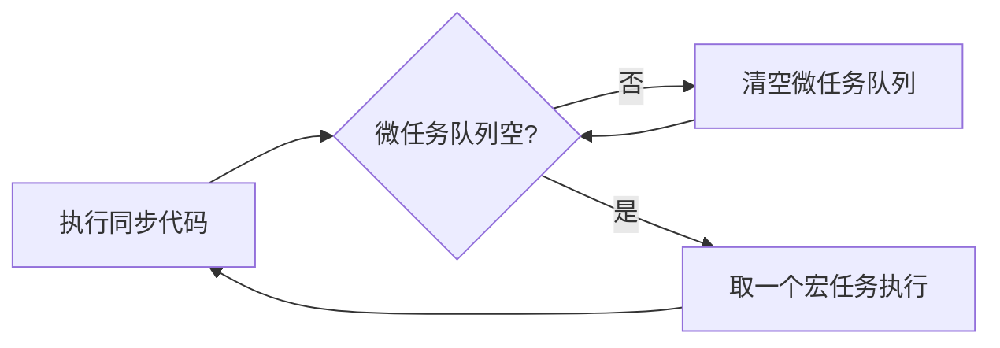
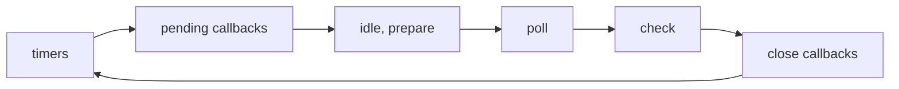

# 事件循环

JavaScript 是**单线程**语言，靠**事件循环（Event Loop）** 调度异步任务，保证页面不卡死。理解事件循环是读懂 `Promise`、`async/await`、性能优化的基础。

## 1. 进程与线程

| 概念 | 说明 |
|:-----|:-----|
| **进程** | 程序的一次运行实例，拥有独立内存空间 |
| **线程** | 进程内的执行单元，同一进程内线程共享内存 |

浏览器是多进程的，前端代码主要跑在**渲染进程**里。

### 浏览器主要进程

1. **浏览器进程**：界面、标签页管理、前进后退
2. **网络进程**：网络请求
3. **渲染进程**：HTML / CSS / JS 解析与绘制（**一个标签页通常一个渲染进程**）
4. **GPU 进程**：3D 绘制、合成
5. **插件进程**：扩展插件（按需）

### 渲染进程在做什么

- 解析 HTML → DOM 树
- 解析 CSS → CSSOM
- 布局（Layout / Reflow）
- 图层合成（Composite）
- 每秒约 60 帧刷新（`requestAnimationFrame`）
- 执行 JS（全局代码、事件回调、定时器回调等）

渲染进程里有一个**渲染主线程**，JS 就运行在这里，因此 JS 是单线程的。

## 2. 为什么需要异步

渲染主线程同时要负责**布局、绘制、执行 JS**。若 JS 长时间同步执行，页面无法及时响应用户操作，出现卡顿。

```js
// 阻塞主线程 3 秒 —— 页面在这 3 秒内无法响应点击
const start = Date.now();
while (Date.now() - start < 3000) {}
```

浏览器做法：耗时或需等待的操作（定时器、网络、DOM 事件等）由其他线程或系统处理，完成后把**回调包装成任务**放进队列，等主线程空闲时执行。主线程始终有机会处理渲染和用户交互。

## 3. 事件循环机制

事件循环是渲染主线程的工作方式：不断从任务队列取任务执行，执行完再取下一个。



### 宏任务与微任务

| 类型 | 常见来源 | 特点 |
|:-----|:---------|:-----|
| **宏任务（Macro Task）** | `script`、`setTimeout`、`setInterval`、`I/O`、`UI 渲染`、`postMessage` | 每次事件循环取**一个** |
| **微任务（Micro Task）** | `Promise.then`、`queueMicrotask`、`MutationObserver`、`async/await` 续体 | 当前宏任务结束后**清空整个微任务队列** |

::: tip 一次循环的顺序
1. 执行当前**宏任务**（如一段 `<script>` 或一个 `setTimeout` 回调）
2. 执行期间产生的所有**微任务**（全部跑完）
3. 必要时**渲染**（浏览器决定时机）
4. 取下一个宏任务，重复
:::

### 经典例题

```js
console.log("1");

setTimeout(() => console.log("2"), 0);

Promise.resolve().then(() => console.log("3"));

console.log("4");

// 输出：1 → 4 → 3 → 2
```

解析：

1. `1`、`4` 同步执行
2. `setTimeout` 回调注册为**宏任务**
3. `Promise.then` 注册为**微任务**
4. 同步代码结束 → 清空微任务 → 打印 `3`
5. 下一轮宏任务 → 打印 `2`

再复杂一点：

```js
console.log("start");

setTimeout(() => console.log("timeout"), 0);

Promise.resolve()
  .then(() => {
    console.log("promise1");
    return Promise.resolve();
  })
  .then(() => console.log("promise2"));

queueMicrotask(() => console.log("micro"));

console.log("end");

// start → end → promise1 → micro → promise2 → timeout
```

`async/await` 本质是 `Promise`，`await` 之后的代码相当于 `.then` 回调，属于**微任务**：

```js
async function foo() {
  console.log("A");
  await bar();
  console.log("B"); // 微任务
}

async function bar() {
  console.log("C");
}

foo();
console.log("D");

// A → C → D → B
```

## 4. 任务队列与优先级

早期说法简单分为「宏队列 + 微队列」。按 [W3C 标准](https://html.spec.whatwg.org/multipage/webappapis.html#perform-a-microtask-checkpoint)，现在更准确的理解是：

- 每个任务有**任务类型**，同类型任务在同一队列
- 不同类型可分属不同队列，队列间有**优先级**
- 浏览器在一次事件循环中决定取哪个队列的任务
- **微任务队列**优先级最高，必须在当前任务后继续清空

### Chrome 中常见的队列（简化）

| 队列 | 存放内容 | 优先级 |
|:-----|:---------|:-------|
| 微队列 | `Promise`、`MutationObserver`、`queueMicrotask` | 最高 |
| 交互队列 | 用户点击、输入等事件回调 | 高 |
| 延时队列 | `setTimeout` / `setInterval` 到期回调 | 中 |

```js
// 立即把函数加入微队列
Promise.resolve().then(fn);
queueMicrotask(fn);
```

## 5. 与渲染的关系

```js
// 修改 DOM 后，浏览器可能在微任务清空后、下一宏任务前进行渲染
box.style.background = "red";

Promise.resolve().then(() => {
  box.style.background = "blue"; // 用户可能只看到蓝色（合并渲染）
});
```

`requestAnimationFrame`（rAF）在**下一次重绘前**执行，适合做动画，比 `setTimeout` 更贴合屏幕刷新：

```js
function animate() {
  el.style.transform = `translateX(${x++}px)`;
  if (x < 300) requestAnimationFrame(animate);
}
requestAnimationFrame(animate);
```

| API | 执行时机 |
|:----|:---------|
| 微任务 | 当前宏任务后，渲染前（通常） |
| `requestAnimationFrame` | 下一帧绘制前 |
| `setTimeout(fn, 0)` | 下一个宏任务，时机不精确 |
| `requestIdleCallback` | 主线程空闲时（低优先级） |

## 6. 定时器为什么不精确

`setTimeout` / `setInterval` **无法做到精确计时**，原因：

1. 计算机没有原子钟，系统计时本身有误差
2. JS 定时器最终调用系统 API，会继承这些误差
3. W3C 规定：嵌套超过 5 层的定时器，最小间隔为 **4ms**
4. 回调须等主线程空闲才能执行——前面有长任务就会延迟

```js
console.log("start");
setTimeout(() => console.log("timeout"), 0);
// 若主线程正忙 2 秒，timeout 至少 2 秒后才打印

const busyStart = Date.now();
while (Date.now() - busyStart < 2000) {}
console.log("end");
```

需要精确定时考虑 `AudioContext`、Web Worker，或接受误差用 `Date.now()` 校正。

## 7. 如何避免阻塞主线程

### 拆分长任务

```js
function processChunk(list, index = 0, chunkSize = 1000) {
  const end = Math.min(index + chunkSize, list.length);
  for (let i = index; i < end; i++) {
    // 处理 list[i]
  }
  if (end < list.length) {
    setTimeout(() => processChunk(list, end, chunkSize), 0);
  }
}
```

### Web Worker

把计算密集型逻辑放到**独立线程**，通过 `postMessage` 通信，不阻塞渲染主线程：

```js
// main.js
const worker = new Worker("compute.js");
worker.postMessage({ data: largeArray });
worker.onmessage = (e) => console.log("结果", e.data);

// compute.js
self.onmessage = (e) => {
  const result = heavyCompute(e.data.data);
  self.postMessage(result);
};
```

### 使用 scheduler API（实验性）

`scheduler.postTask` 可按优先级调度任务（Chrome 逐步支持）。

## 8. Node.js 事件循环（简述）

Node 与浏览器模型不同，基于 **libuv**，分多个阶段：



| 阶段 | 典型任务 |
|:-----|:---------|
| timers | `setTimeout`、`setInterval` 到期 |
| poll | I/O 回调、`fs.readFile` |
| check | `setImmediate` |
| microtask | `process.nextTick`（优先于 Promise）、`Promise.then` |

```js
setTimeout(() => console.log("timeout"), 0);
setImmediate(() => console.log("immediate"));

// 顺序因上下文而异；顶层脚本中常见 timeout 先于 immediate
```

::: info 浏览器 vs Node
- 浏览器：微任务（Promise）→ 渲染 → 宏任务
- Node：`process.nextTick` 优先级高于 Promise 微任务
:::

## 9. 常见面试题

### 题 1

```js
async function async1() {
  console.log("async1 start");
  await async2();
  console.log("async1 end");
}
async function async2() {
  console.log("async2");
}
console.log("script start");
setTimeout(() => console.log("setTimeout"), 0);
async1();
new Promise((resolve) => {
  console.log("promise1");
  resolve();
}).then(() => console.log("promise2"));
console.log("script end");
```

```
script start → async1 start → async2 → promise1 → script end
→ async1 end → promise2 → setTimeout
```

### 题 2：`Promise` 链

```js
Promise.resolve()
  .then(() => {
    console.log(1);
    throw new Error("err");
  })
  .catch(() => console.log(2))
  .then(() => console.log(3));

// 1 → 2 → 3（catch 后链恢复为 fulfilled）
```

## 10. MutationObserver 与微任务

`MutationObserver` 监听 DOM 变化，回调作为**微任务**调度——比 `setTimeout` 更早，适合在 DOM 更新后、渲染前读取布局。

```js
const box = document.querySelector("#box");
const log = [];

const observer = new MutationObserver(() => {
  log.push("mutation");
});

observer.observe(box, { childList: true, attributes: true });

box.setAttribute("data-x", "1");
box.appendChild(document.createElement("span"));

Promise.resolve().then(() => log.push("promise"));
setTimeout(() => log.push("timeout"), 0);

// 同步代码结束后：mutation → promise →（渲染）→ timeout
console.log(log.join(" → "));
```

典型用途：

- 监听元素尺寸/属性变化做自适应
- 框架内部在 DOM patch 后收集副作用（类似「更新后回调」）
- 与 `ResizeObserver` 配合（`ResizeObserver` 回调也是微任务）

::: tip 与 Promise 的优先级
同属微任务队列，`MutationObserver` 与 `Promise.then` 谁先谁后取决于**注册顺序**，同一轮微任务阶段按入队顺序执行。
:::

## 11. MessageChannel 与宏任务技巧

`MessageChannel` 的 `port.postMessage` 会调度一个**宏任务**（与 `setTimeout` 同属宏任务，但无 4ms 嵌套延迟限制）。

```js
const channel = new MessageChannel();
const log = [];

channel.port1.onmessage = () => log.push("messageChannel");
channel.port2.onmessage = () => {}; // 另一端也需监听避免泄漏

Promise.resolve().then(() => log.push("promise"));
channel.port1.postMessage("hi");
setTimeout(() => log.push("timeout"), 0);

// promise → messageChannel → timeout
console.log(log.join(" → "));
```

### 为什么框架会关心这个？

有时需要「**等所有微任务跑完**再执行回调」——若用 `Promise.then` 注册，自己也在微队列里，无法保证排在其他微任务之后。

Vue 2 的 `nextTick` 在部分环境用 `MessageChannel`（或 `setImmediate`）把回调放到**宏任务**，从而确保 DOM 更新产生的微任务已全部执行：

```js
// 简化理解：等微任务清空后的「下一轮」
function nextTick(fn) {
  if (typeof MutationObserver !== "undefined") {
    const ob = new MutationObserver(() => {
      fn();
      ob.disconnect();
    });
    ob.observe(document.createTextNode(""), { characterData: true });
    // 触发 mutation...
  } else {
    setTimeout(fn, 0);
  }
}
```

Vue 3 的 `nextTick` 基于 `Promise` 微任务；React 18 的批量更新也依赖微任务调度。了解 `MessageChannel` 有助于理解「为什么有时 deliberately 避开 Promise」。

### 宏 / 微任务选型

| 需求 | 推荐 API |
|:-----|:---------|
| 尽快执行，当前任务后 | `Promise.then` / `queueMicrotask` |
| DOM 变更后读取布局 | `MutationObserver` / `requestAnimationFrame` |
| 等本轮所有微任务结束 | `MessageChannel` / `setTimeout(0)` |
| 下一帧绘制前做动画 | `requestAnimationFrame` |
| 主线程空闲时低优任务 | `requestIdleCallback` |

## 12. 交互 Demo：亲眼看到执行顺序

点击按钮，观察同步代码、微任务、宏任务、`rAF` 的打印顺序（打开控制台同步查看）。

::: normal-demo 事件循环执行顺序

```html
<button id="run">运行测试</button>
<button id="clear">清空日志</button>
<ul id="log"></ul>
```

```js
const logEl = document.querySelector("#log");

function append(msg) {
  const li = document.createElement("li");
  li.textContent = `${performance.now().toFixed(1)}ms  ${msg}`;
  logEl.appendChild(li);
}

document.querySelector("#run").onclick = () => {
  append("1. 同步 start");

  setTimeout(() => append("5. setTimeout 宏任务"), 0);

  Promise.resolve().then(() => append("3. Promise 微任务"));

  queueMicrotask(() => append("4. queueMicrotask 微任务"));

  requestAnimationFrame(() => append("6. rAF 下一帧前"));

  const channel = new MessageChannel();
  channel.port1.onmessage = () => append("5b. MessageChannel 宏任务");
  channel.port1.postMessage("");

  append("2. 同步 end");
};

document.querySelector("#clear").onclick = () => {
  logEl.innerHTML = "";
};
```

```css
#log {
  font-family: monospace;
  font-size: 14px;
  line-height: 1.8;
  padding: 12px;
  background: #f5f5f5;
  border-radius: 8px;
  max-height: 320px;
  overflow-y: auto;
}
button {
  margin-right: 8px;
  padding: 6px 14px;
  cursor: pointer;
}
```

:::

典型输出顺序（时间戳会变化，顺序稳定）：

```
1. 同步 start
2. 同步 end
3. Promise 微任务
4. queueMicrotask 微任务
5. setTimeout 宏任务        （与 5b 先后因环境略有差异）
5b. MessageChannel 宏任务
6. rAF 下一帧前
```

### 微任务嵌套会饿死宏任务吗？

```js
function loop() {
  Promise.resolve().then(loop);
}
loop();
setTimeout(() => console.log("永远轮不到"), 0);
```

会。微任务队列不断被新微任务填满，宏任务（含 `setTimeout`、用户点击）迟迟得不到执行——**不要在微任务里无限递归**。应改用 `setTimeout`、`rAF` 或 `MessageChannel` 把后续工作降到宏任务。

## 13. 速查

| 概念 | 要点 |
|:-----|:-----|
| 单线程 | JS 跑在渲染主线程（浏览器） |
| 宏任务 | 每次循环执行一个 |
| 微任务 | 当前宏任务后全部清空 |
| `Promise.then` | 微任务 |
| `await` 后续 | 微任务 |
| `setTimeout(0)` | 宏任务，非立即 |
| rAF | 下一帧前，做动画 |
| 定时器误差 | 主线程忙、4ms 嵌套限制 |
| Worker | 独立线程，不阻塞 UI |
| Node | libuv 多阶段 + `nextTick` |
| `MutationObserver` | DOM 变更回调，微任务 |
| `MessageChannel` | `postMessage` 调度宏任务 |
| `queueMicrotask` | 显式加入微队列 |
| 微任务死循环 | 会饿死宏任务，避免无限 `then` 链 |

相关文档：[README.md](./README.md)（防抖节流）、[designModel.md](./designModel.md)（等待者 / Promise）。
