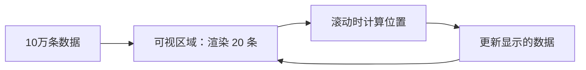

# 前端性能优化

## 一、性能指标与测量

### 核心 Web 指标（Core Web Vitals）

| 指标 | 含义 | 衡量内容 | 建议值 |
|------|------|----------|--------|
| **LCP** (Largest Contentful Paint) | 最大内容绘制 | 页面主要内容加载完成时间 | ≤ 2.5s |
| **FID** (First Input Delay) | 首次输入延迟 | 用户首次交互到响应的时间 | ≤ 100ms |
| **CLS** (Cumulative Layout Shift) | 累积布局偏移 | 页面内容意外移动的程度 | ≤ 0.1 |

### 其他关键指标

| 指标 | 含义 | 说明 |
|------|------|------|
| **TTFB** | Time To First Byte | 服务器响应首字节时间，反映网络和服务器性能 |
| **FP** | First Paint | 首次绘制，浏览器渲染第一个像素 |
| **FCP** | First Contentful Paint | 首次内容绘制，渲染第一个文本/图片 |
| **TBT** | Total Blocking Time | 总阻塞时间，FCP 到 TTI 之间主线程被阻塞的总时间 |
| **TTI** | Time To Interactive | 页面完全可交互的时间 |

### 测量方式

```js
// 1. Performance API（浏览器）
window.performance.getEntriesByType('navigation')
performance.getEntriesByType('paint') // FP、FCP

// 2. Performance Observer（推荐）
const observer = new PerformanceObserver((list) => {
  for (const entry of list.getEntries()) {
    console.log(entry.name, entry.startTime, entry.duration)
  }
})
observer.observe({ type: 'largest-contentful-paint', buffered: true })
observer.observe({ type: 'layout-shift', buffered: true })
observer.observe({ type: 'first-input', buffered: true })

// 3. Lighthouse（工具）
// Chrome DevTools → Lighthouse → Generate report
```

---

## 二、加载优化

### 1. 减少 HTTP 请求

- **合并资源**：CSS/JS 文件合并（构建工具自动处理）
- **雪碧图**：将多个小图标合并为一张图片
- **内联小资源**：小图片转 Base64 或 Data URI（webpack/vite 自动处理）
- **HTTP/2 多路复用**：升级到 HTTP/2 后合并反而可能降低缓存粒度，需权衡

### 2. 资源压缩

| 资源类型 | 压缩方式 | 效果 |
|----------|---------|------|
| HTML | 去除空格、注释 | 缩小 10-20% |
| CSS | CSS Nano / Lightning CSS | 缩小 30-50% |
| JS | Terser / esbuild / SWC | 缩小 60-70% |
| 图片 | WebP / AVIF / Sharp | 缩小 60-80% |
| 字体 | 子集化（仅含用到的字符） | 缩小 90%+ |

### 3. 使用 CDN

- 静态资源部署到 CDN，利用边缘节点加速
- 常用的 CDN 服务：Cloudflare、阿里云 CDN、七牛云、jsDelivr（开源）
- CDN 也提供 gzip/brotli 压缩和 HTTP/2 支持

### 4. 启用 GZIP / Brotli 压缩

```
# Nginx 配置 Gzip
gzip on
gzip_types text/plain text/css application/json application/javascript text/xml image/svg+xml
gzip_min_length 1024
gzip_vary on

# Brotli 压缩率更高（比 gzip 小 20-30%），但需要 Nginx 编译 brotli 模块
```

### 5. 利用浏览器缓存

```
# 强缓存（不请求服务器）
Cache-Control: max-age=31536000, immutable   # 带 hash 的资源文件

# 协商缓存（需要验证）
Cache-Control: no-cache
ETag: "file-hash"

# 不缓存
Cache-Control: no-store

# HTML 文档：每次都验证
Cache-Control: no-cache
```

### 6. 资源加载优先级

```html
<!-- preload：提前加载关键资源（当前页面需要的） -->
<link rel="preload" href="font.woff2" as="font" crossorigin>
<link rel="preload" href="main.js" as="script">

<!-- prefetch：空闲时加载将来可能用到的资源（下一页） -->
<link rel="prefetch" href="/detail-page.js">

<!-- preconnect：提前建立连接（DNS + TCP + TLS） -->
<link rel="preconnect" href="https://api.example.com">

<!-- dns-prefetch：仅提前解析 DNS -->
<link rel="dns-prefetch" href="https://cdn.example.com">

<!-- 延迟非关键 CSS -->
<link rel="preload" href="non-critical.css" as="style" onload="this.onload=null;this.rel='stylesheet'">

<!-- script 加载策略 -->
<script src="critical.js"></script>                     <!-- 同步阻塞 -->
<script defer src="deferred.js"></script>               <!-- 延迟到 DOM 解析完后执行 -->
<script async src="async.js"></script>                   <!-- 异步加载，加载完立即执行 -->
```

> **defer vs async**：defer 按顺序执行（HTML 解析完后），async 加载完就执行（顺序不确定）。

### 7. 代码分割（Code Splitting）

```js
// 路由懒加载（Vue）
const routes = [
  { path: '/detail', component: () => import('./views/Detail.vue') }
]

// React.lazy
const Detail = React.lazy(() => import('./Detail'))

// Webpack/Vite 动态导入
import(/* webpackChunkName: "chart" */ './heavyChart.js')
```

### 8. 服务端渲染（SSR） / 静态生成（SSG）

| 方式 | 说明 | 适用场景 |
|------|------|----------|
| CSR | 客户端渲染 | SPA 后台、工具类 |
| SSR | 服务端渲染，返回 HTML + 注水 | SEO 重要、首屏要求高的页 |
| SSG | 构建时生成静态 HTML | 博客、文档站 |
| ISR | 增量静态再生 | 内容频繁更新的站点 |

---

## 三、图片优化

### 选择合适的格式

| 格式 | 特点 | 适用场景 |
|------|------|----------|
| JPEG | 有损压缩，不支持透明 | 照片、复杂渐变图 |
| PNG | 无损压缩，支持透明 | 图标、截图、需要透明的图 |
| WebP | 有损/无损，支持透明 | 现代浏览器的首选（比 JPEG 小 25-35%） |
| AVIF | 压缩率更高 | 下一代格式（Chrome 支持） |
| SVG | 矢量图，无限缩放 | 图标、Logo、插画 |

### 图片优化策略

```html
<!-- 响应式图片：根据屏幕尺寸加载不同大小 -->


<!-- 使用 WebP 并降级 -->
<picture>
  <source type="image/avif" srcset="photo.avif">
  <source type="image/webp" srcset="photo.webp">
  
</picture>

<!-- 懒加载（浏览器原生） -->


<!-- 占位图技术 -->

```

### 图片压缩工具

```
在线工具：tinypng.com, squoosh.app
CLI：sharp (Node), imagemin, avif-cli
构建插件：vite-plugin-imagemin, webpack-image-minimizer
```

---

## 四、JavaScript 优化

### 1. 避免长任务阻塞主线程

```js
// 拆分长任务（大于 50ms）
// 不好的方式
heavyTask()

// 好的方式：分片执行
function chunkedTask(items) {
  const chunk = items.splice(0, 50)
  // 处理这一批
  chunk.forEach(process)
  if (items.length > 0) {
    requestIdleCallback(() => chunkedTask(items))
    // 或 requestAnimationFrame
  }
}

// 将大计算放到 Web Worker
const worker = new Worker('heavy-worker.js')
worker.postMessage({ data })
worker.onmessage = (e) => console.log('结果', e.data)
```

### 2. 减少重排和重绘（Reflow & Repaint）

- 避免频繁读写样式，使用 class 批量修改
- 使用 `transform` 和 `opacity` 做动画（触发合成层，不触发重排）
- 对频繁动画的元素使用 `will-change: transform` 或 `contain: layout`
- 避免使用 `table` 布局（table 的 reflow 开销更大）
- 将需要多次读写的 DOM 元素脱离文档流（absolute/fixed）

```js
// 不好的方式
for (let i = 0; i < 100; i++) {
  el.style.left = i + 'px' // 每次触发 reflow
}

// 好的方式
el.style.transform = `translateX(100px)` // 仅触发合成
```

### 3. 事件委托

```js
// 不好的方式：每个 li 绑定事件
document.querySelectorAll('li').forEach(el => {
  el.addEventListener('click', handler)
})

// 好的方式：委托到父元素
document.querySelector('ul').addEventListener('click', (e) => {
  if (e.target.tagName === 'LI') handler(e)
})
```

### 4. 防抖与节流

```js
// 防抖（Debounce）：连续触发只执行最后一次
function debounce(fn, delay = 300) {
  let timer
  return (...args) => {
    clearTimeout(timer)
    timer = setTimeout(() => fn(...args), delay)
  }
}

// 节流（Throttle）：固定频率执行
function throttle(fn, interval = 200) {
  let last = 0
  return (...args) => {
    const now = Date.now()
    if (now - last >= interval) {
      last = now
      fn(...args)
    }
  }
}

// 使用场景
window.addEventListener('resize', debounce(resizeHandler, 200))
window.addEventListener('scroll', throttle(scrollHandler, 100))
input.addEventListener('input', debounce(searchAPI, 500))
```

### 5. 虚拟列表

当渲染大量列表项（万级）时，只渲染可视区域的 DOM 节点：



常见虚拟列表库：`vue-virtual-scroller`、`react-window`、`@tanstack/virtual`

---

## 五、CSS 优化

### 1. 选择器性能

- 避免嵌套过深（最多 3-4 层）
- 避免使用通配选择器 `*`
- 避免 `#id .class` 冗余选择器
- 使用 BEM 命名减少嵌套

### 2. 动画优化

```css
/* 推荐使用 transform/opacity 做动画 */
.element {
  transition: transform 0.3s ease;
  /* will-change 提前告知浏览器，但不宜滥用 */
  will-change: transform;
}

/* avoid：会触发重排的属性 */
/* top, left, width, height, margin, padding */
```

### 3. 关键 CSS 内联

将首屏需要的 CSS 内联到 HTML `<head>` 中，非关键 CSS 延迟加载：

```html
<head>
  <!-- 关键 CSS 内联 -->
  <style>
    .header { ... }
    .hero { ... }
  </style>
  <!-- 非关键 CSS 延迟加载 -->
  <link rel="preload" href="styles.css" as="style" onload="this.rel='stylesheet'">
</head>
```

### 4. 减少 @import

```css
/* 不好的方式：@import 会造成串行下载 */
@import url('reset.css');
@import url('theme.css');

/* 好的方式：在 HTML 中用 link 并行下载 */
<link rel="stylesheet" href="reset.css">
<link rel="stylesheet" href="theme.css">
```

### 5. contain 属性

```css
/* 告诉浏览器该元素的布局/绘制独立，不会影响外部 */
.side-panel {
  contain: layout style paint;
  /* 或简写 */
  contain: strict;
}
```

---

## 六、字体优化

### 字体加载策略

```css
/* 使用 font-display 控制字体加载行为 */
@font-face {
  font-family: 'CustomFont';
  src: url('font.woff2') format('woff2');
  font-display: swap;  /* 先显示后备字体，加载完后替换 */
  /* auto: 浏览器默认策略 */
  /* block: 最多阻塞 3s，然后后备 */
  /* swap: 立即用后备，加载完替换 */
  /* fallback: 短时间阻塞 + 后备，加载完不替换（很短的时间窗口） */
  /* optional: 用后备，看网络情况决定是否加载 */
}
```

### 字体子集化

```css
/* 只保留用到的字符，减少字体文件体积 */
/* 工具：glyphhanger, fonttools, subfont */
@font-face {
  font-family: 'MyIconFont';
  src: url('iconfont-subset.woff2') format('woff2');
  unicode-range: U+E601-E61E;  /* 只加载这个范围的字形 */
}
```

### 提前加载字体

```html
<link rel="preload" href="font.woff2" as="font" crossorigin>
```

---

## 七、构建优化

### Webpack / Vite 优化策略

```js
// 1. 摇树优化（Tree Shaking）：默认启用，确保使用 ESM
// 2. 代码分割
// Vite 示例
export default defineConfig({
  build: {
    rollupOptions: {
      output: {
        manualChunks: {
          vendor: ['vue', 'vue-router'],
          chart: ['echarts'],
        }
      }
    },
    // 启用 CSS 代码分割
    cssCodeSplit: true,
    // 生成 sourcemap 但不包含原始代码（仅行映射）
    sourcemap: 'hidden',
  }
})
```

### 体积分析

```bash
# Vite 体积分析
npm install rollup-plugin-visualizer

# webpack-bundle-analyzer
npm install webpack-bundle-analyzer
```

---

## 八、网络优化

### 1. DNS 预解析

```html
<!-- 提前解析第三方域名的 DNS -->
<link rel="dns-prefetch" href="https://cdn.example.com">
<link rel="dns-prefetch" href="https://api.example.com">
```

### 2. 预连接

```html
<link rel="preconnect" href="https://api.example.com">
```

### 3. 预加载 / 预获取

```html
<!-- 当前页面关键资源 -->
<link rel="preload" href="critical.css" as="style">

<!-- 下一个页面可能需要的资源 -->
<link rel="prefetch" href="/next-page.js">

<!-- 预渲染整个页面（谨慎使用，耗内存） -->
<link rel="prerender" href="/next-page.html">
```

### 4. Service Worker 缓存

```js
// 使用 Workbox（Google 的 SW 工具库）
// service-worker.js
import { precacheAndRoute } from 'workbox-precaching'
import { registerRoute } from 'workbox-routing'
import { StaleWhileRevalidate } from 'workbox-strategies'

// 预缓存静态资源
precacheAndRoute(self.__WB_MANIFEST)

// API 请求：过期时重新验证
registerRoute(
  ({ url }) => url.pathname.startsWith('/api/'),
  new StaleWhileRevalidate()
)
```

---

## 九、渲染优化

### 1. 减少 DOM 节点数

- 过深的 DOM 树影响渲染性能
- 建议：正文 `<body>` 内节点不超过 1500 个，深度不超过 32 层

### 2. requestAnimationFrame 与 requestIdleCallback

```js
// requestAnimationFrame：下一帧渲染前执行（适合动画）
function animate() {
  updatePosition()
  requestAnimationFrame(animate)
}

// requestIdleCallback：浏览器空闲时执行（适合非关键任务）
requestIdleCallback(() => {
  prefetchData()  // 不影响用户交互
}, { timeout: 2000 })  // 最多等 2s
```

### 3. 长列表优化

- 虚拟列表（见第四部分）
- 分页加载
- 无限滚动 + 缓冲（渲染适量 DOM）

### 4. 离屏渲染（OffscreenCanvas）

```js
// 将 Canvas 绘制放到 Worker 中
const canvas = document.getElementById('canvas')
const offscreen = canvas.transferControlToOffscreen()
const worker = new Worker('canvas-worker.js')
worker.postMessage({ canvas: offscreen }, [offscreen])
```

---

## 十、移动端优化

| 优化点 | 做法 |
|--------|------|
| 首屏加载 | SSR / SSG，减少首屏 JS |
| 触摸事件 | touch 事件延迟 300ms → 设置 `touch-action: manipulation` |
| 图片自适应 | `srcset` + `sizes` 按设备加载 |
| 减少重排 | 使用 `transform`、`opacity` |
| 点击区域 | 按钮最小 44x44px |
| 渲染层 | 启用 GPU 加速（`will-change`） |

---

## 十一、性能优化清单（Checklist）

### 加载阶段
- [ ] 启用 Gzip/Brotli 压缩
- [ ] 资源使用 CDN
- [ ] 图片使用 WebP/AVIF 并按需加载
- [ ] Lazy Load 非首屏图片和组件
- [ ] 关键 CSS 内联
- [ ] 使用 `<link rel="preload">` 加载关键资源
- [ ] 代码分割 + 路由懒加载
- [ ] 合理设置缓存策略

### 渲染阶段
- [ ] 避免长任务阻塞主线程
- [ ] 使用 transform/opacity 做动画
- [ ] 减少 DOM 节点数
- [ ] 事件委托代替批量绑定
- [ ] 防抖/节流高频事件
- [ ] 使用虚拟列表渲染大数据量

### 运行时
- [ ] 及时清理定时器和事件监听
- [ ] 避免内存泄漏（全局变量、闭包）
- [ ] 使用 Web Worker 处理 CPU 密集型任务
- [ ] Service Worker 缓存静态资源和 API

---

## 十二、常用分析工具

| 工具 | 用途 |
|------|------|
| Chrome DevTools → Performance | 录制和分析性能瓶颈 |
| Chrome DevTools → Lighthouse | 生成性能报告和优化建议 |
| Chrome DevTools → Coverage | 查看 CSS/JS 使用覆盖率（找出无用代码） |
| WebPageTest | 多地区/多设备性能测试 |
| PageSpeed Insights | 核心 Web 指标分析 |
| BundlePhobia | 分析 npm 包体积和加载时间 |
| Sonar | Web 性能监控平台 |
