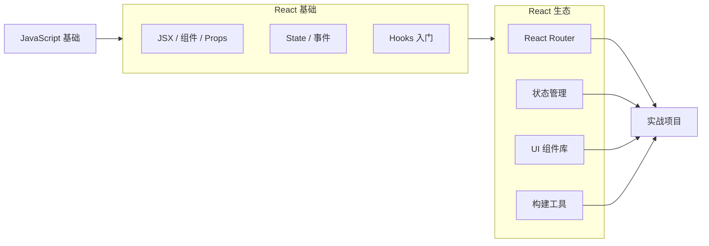
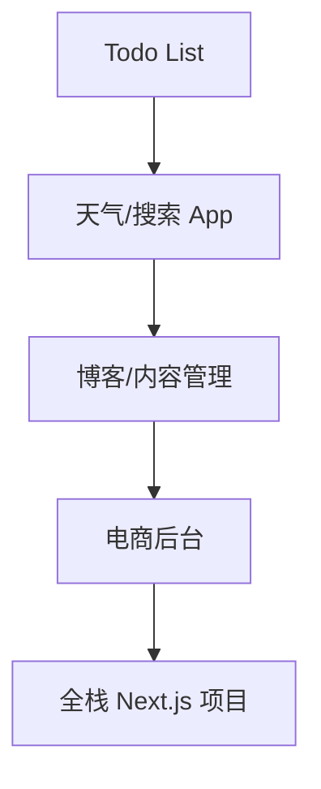

# 如何学习 React

## 一、前置知识

在开始 React 之前，确保以下基础扎实：

| 知识 | 说明 |
|------|------|
| **HTML / CSS** | 语义化标签、Flex/Grid 布局、响应式设计 |
| **JavaScript ES6+** | 箭头函数、解构赋值、模板字符串、模块导入导出 |
| **数组方法** | map、filter、reduce、find — React 渲染列表的基石 |
| **异步编程** | Promise、async/await |
| **面向对象** | class、this、继承（理解旧项目需要） |

## 二、React 核心概念（按学习顺序）

### 第一阶段：基础（1-2 周）

```
JSX → 组件 → Props → State → 事件处理 → 条件渲染 → 列表渲染
```

| 概念 | 一句话理解 |
|------|-----------|
| **JSX** | 在 JS 中写 HTML 标签的语法糖，最终编译为 `React.createElement` |
| **组件** | 函数（或 class）返回一段 UI，可复用 |
| **Props** | 父组件传给子组件的数据，只读不可修改 |
| **State** | 组件内部状态，更新 state 触发重新渲染 |
| **事件处理** | `onClick`、`onChange` 等，驼峰命名 |
| **条件渲染** | 用 `if` 或三元表达式控制渲染内容 |
| **列表渲染** | `arr.map()` 渲染列表，需要 `key` |

### 第二阶段：深入（2-3 周）

```
useState → useEffect → 组件通信 → 表单 → 理解 React 渲染流程
```

#### Hooks 核心

```jsx
// useState — 管理组件状态
const [count, setCount] = useState(0)

// useEffect — 副作用（数据请求、订阅、DOM 操作）
useEffect(() => {
  fetchData()
  return () => cleanup() // 清理函数
}, [dependencies]) // 空数组 = 挂载时执行一次
```

#### 组件通信方式

```
父→子：Props
子→父：回调函数
兄弟组件：状态提升到共同父组件
深层传递：Context
复杂状态：状态管理库（Redux / Zustand / Jotai）
```

### 第三阶段：进阶（3-5 周）

```
useRef → useMemo → useCallback → 自定义 Hooks → 性能优化 → 错误边界
```

#### 自定义 Hooks

```jsx
// 把逻辑抽离为可复用的 Hook
function useWindowSize() {
  const [size, setSize] = useState({ width: 0, height: 0 })
  useEffect(() => {
    const handler = () => setSize({ width: window.innerWidth, height: window.innerHeight })
    window.addEventListener('resize', handler)
    handler()
    return () => window.removeEventListener('resize', handler)
  }, [])
  return size
}

// 使用
const { width, height } = useWindowSize()
```

## 三、学习路径图



## 四、React 生态必学

| 库 | 用途 | 学习优先级 |
|----|------|-----------|
| **React Router** | 前端路由（SPA 页面切换） | ⭐⭐⭐ |
| **状态管理** | 全局状态（Zustand 简单 / Redux 复杂） | ⭐⭐⭐ |
| **Ant Design / Arco Design** | UI 组件库，快速搭建页面 | ⭐⭐ |
| **React Hook Form** | 表单处理 | ⭐⭐ |
| **TanStack Query** | 服务端状态管理（请求缓存） | ⭐⭐ |
| **Next.js** | React 全栈框架（SSR/SSG） | ⭐⭐⭐ |
| **TypeScript** | 静态类型，大型项目必备 | ⭐⭐⭐ |

## 五、学习建议

### 1. 先理解「为什么」

不要死记硬背 API，先理解 React 解决问题的思路：

- 为什么 React 要引入虚拟 DOM？—— 减少真实 DOM 操作
- 为什么需要 state？—— 数据驱动视图，无需手动操作 DOM
- 为什么要不可变数据？—— 方便对比变化，提升性能
- 为什么 Hooks 不能放在条件语句中？—— 保证 Hook 调用顺序稳定

### 2. 多写 Demo 小项目

```
Todo List          → useState + 事件处理
天气查询 App       → useEffect + API 请求
购物车             → 状态提升 + 组件通信
Markdown 编辑器     → 受控组件 + 第三方库集成
博客               → React Router + 状态管理
```

### 3. 读源码的技巧

初学阶段不需要读源码。当对某个 API 产生疑问时（如 "useEffect 的清理函数何时执行？"），带着问题去翻源码。

### 4. 推荐资源

**文档：**

- [React 官方文档](https://react.dev) — 必读，建议通读一遍
- [React 官方教程（Tic-Tac-Toe）](https://react.dev/learn/tutorial-tic-tac-toe) — 入门最佳实践

**书籍：**

- 《React 设计原理》— 卡颂
- 《深入浅出 React 和 Redux》
- 《Learning React, 2nd Edition》

**学习平台：**

- [React TypeScript Cheatsheet](https://react-typescript-cheatsheet.netlify.app/) — React + TS 速查

### 5. 常见误区

```
❌ 一上来就学 Redux
❌ 用 class 组件写新项目（过时了）
❌ 滥用 useEffect 做数据转换（能用派生状态就用派生状态）
❌ 把所有状态都放到全局 store
❌ 直接拷贝 npm 包代码不懂其原理
```

### 6. 建立 React 思维

React 的核心思维是 **「数据驱动视图」**：

```
user action → state change → re-render → DOM update
```

与传统 jQuery 的思维差异：

| 场景 | jQuery 方式 | React 方式 |
|------|------------|-----------|
| 更新文本 | `$('#el').text('新内容')` | `setState('新内容')`，React 自动更新 DOM |
| 显示/隐藏 | `$('#el').show()` | 用 `if` 条件渲染，或 CSS class 控制 |
| 添加列表项 | `$('#list').append('<li>...')` | `setState([...list, newItem])`，重新渲染列表 |

> **最重要的一条**：不要想着「我要操作哪个 DOM 元素」，而是想「我的数据应该是什么样子」。

## 六、实战建议

### 从模仿开始

1. 找一个你喜欢的网站（管理后台、博客、TODO 应用）
2. 用 React 重新实现它
3. 先用原生 JS 拆分为组件，然后用 React 实现

### 项目渐进路线



每个项目比上一个多学 2-3 个新概念，不要跳级。
