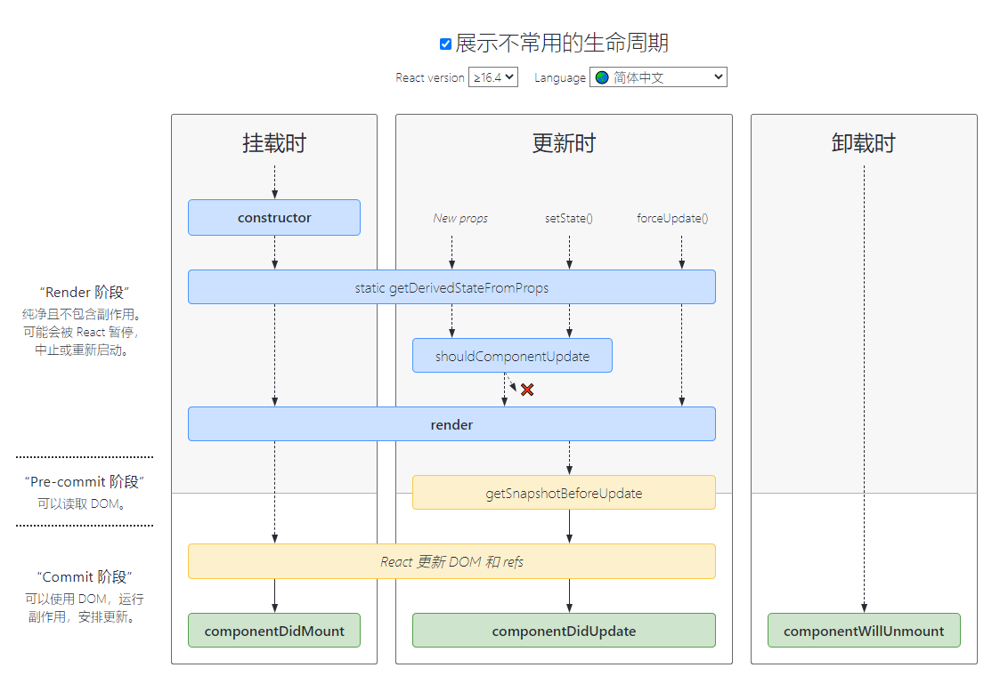

# react 生命周期

## 组件 && Props的只读性

### 1. 纯函数
  - 函数`不会`尝试`更改入参`，且多次调用下相同的入参始终返回相同的结果,这样的函数称之为`“纯函数”`。
```js
function sum(a, b) {
  return a + b;
}
```
### 2. Props 的只读性
- 组件无论是使用函数声明还是通过 class 声明，都`决不能修改`自身的 `props`。
- 所有 React 组件都必须像`纯函数`一样保护它们的 `props 不被更改`。

## 生命周期
 ### 1.加载组件时方法的调用顺序



#### 1. 首次加载
`constructor` ---> `static getDerivedStateFromProps()` 初始化 `this.state` ---> `render()` ---> `React 更新 DOM 和 refs` ---> `componentDidMount()`
#### 2. 更新

`"New props"`, `"setSate()"`, `"forceUpdate"` 三种方式更新触发

`static getDerivedStateFromProps()` ---> `shouldComponentUpdate()` 使用 "forceUpdate" 不触发， 返回值false 不重新渲染 ---> `render()` ---> 
`getSnapshotBeforeUpdate()`---> `React 更新 DOM 和 refs` ---> `componentDidUpdate()`

::: tip
`getSnapshotBeforeUpdate()` 在最近一次渲染输出（提交到 DOM 节点）之前调用。它使得组件能在发生更改之前从 DOM 中捕获一些信息（例如，滚动位置）。此生命周期方法的任何返回值将作为参数`snapshot`传递给 `componentDidUpdate(prevProps, prevState, snapshot)`
:::

#### 3. 卸载时
`组件` 从 `DOM` 中被移除 --> `componentWillUnmount()`

### componentDidUpdate用法

```js
	componentDidUpdate(prevProps, prevState, snapshot)
```

::: tip
 1. `componentDidUpdate()` 会在更新后会被立即调用。首次渲染不会执行此方法。
 2. 当组件更新后，可以在此处对 DOM 进行操作
 3. 可以在其中直接调用`setState()`,但要被包裹在一个条件语句里；否则会导致死循环
 4. 如果组件实现了 `getSnapshotBeforeUpdate()` 生命周期（不常用），则它的返回值将作为 `componentDidUpdate()` 的第三个参数 `“snapshot”` 参数传递。否则此参数将为 `undefined`。
 5. 如果 `shouldComponentUpdate()` 返回值为 `false`，则不会调用 `componentDidUpdate()`。
:::
 


## react中的传值方式

### 1.父传子
- `props` 传递
- `context` 传递
- `redux` 传递
### 2. 子传父
- `props` 传递
- `redux` 传递
### 3. 兄弟组件传递
- `props` 传递
- `redux` 传递

## context的使用
数据是通过 `props` 属性`自上而下（由父及子）`进行传递的;`Context` 提供了一种在组件之间`共享此类值`的方式，而不必显式地通过组件树的逐层传递 `props`。
### 1.provider的用法
```html
<MyContext.Provider value={/* 某个值 */}>
```
`Provider` 接收一个`value` 属性，传递给`消费组件`。一个 `Provider` 可以和`多个消费组件`有对应关系。多个 `Provider` 也可以嵌套使用，`里层的会覆盖外层`的数据。

当 `Provider` 的 `value` 值发生变化时，它内部的所有`消费组件`都会`重新渲染`。`Provider` 及其内部 `consumer` 组件都不受制于 `shouldComponentUpdate` 函数，因此当 `consumer` 组件在其祖先组件退出更新的情况下也能更新。
### 2.consumer的用法
```html
<MyContext.Consumer>
  {value => /* 基于 context 值进行渲染*/}
</MyContext.Consumer>
```
`函数式组件`中完成订阅 `context`。

这需要`函数作为子元素（function as a child）`这种做法。这个函数接收当前的 `context` 值，返回一个 `React` 节点。传递给函数的 `value` 值等同于往上组件树离
这个 `context` 最近的 `Provider` 提供的 `value` 值。如果没有对应的 `Provider`，`value` 参数等同于传递给 `createContext()` 的 `defaultValue`。

4. hooks的使用
6. echarts中label文字长度的获取；点击每个柱形要怎么调用弹框
7. react中可以使用requirejs吗（一般使用ES6模块化导入，也可以用require，写法为 const component = require('./component') ）
8. 中英文或主题色切换怎么实现的；切换后页面会刷新吗
9. 安全性功能做过哪些
10. 加载几百页的pdf时，有什么优化操作
