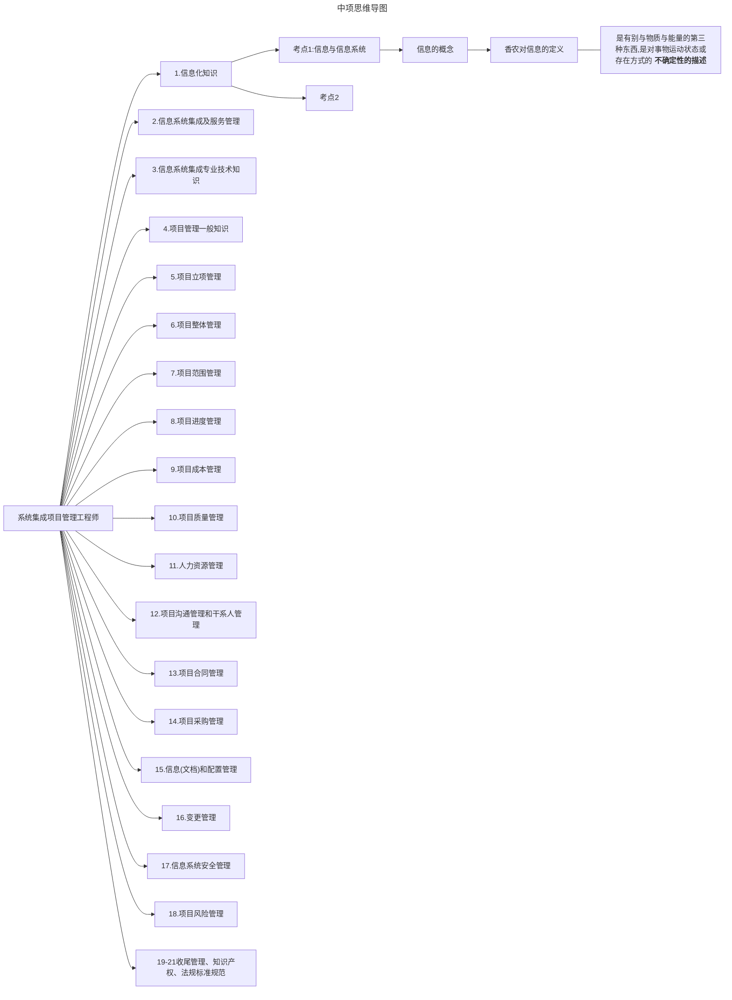

# 软考

```mermaid
---
title: 中项思维导图
---
%%{init: {"flowchart": {"htmlLabels": false}} }%%
flowchart LR
   系统集成项目管理工程师 --> 1[1.信息化知识] & 2[2.信息系统集成及服务管理] & 3[3.信息系统集成专业技术知识] & 4[4.项目管理一般知识] & 5[5.项目立项管理] & 6[6.项目整体管理] & 7[7.项目范围管理] & 8[8.项目进度管理] & 9[9.项目成本管理] & 10[10.项目质量管理] & 11[11.人力资源管理] & 12[12.项目沟通管理和干系人管理] & 13[13.项目合同管理] & 14[14.项目采购管理] & 15["15.信息(文档)和配置管理"] & 16[16.变更管理] & 17[17.信息系统安全管理] & 18[18.项目风险管理] & 19["19-21收尾管理、知识产权、法规标准规范"]
   1 --> 1考点1[考点1:信息与信息系统] & 考点2
   1考点1 --> 信息的概念
   信息的概念 --> 香农对信息的定义
   香农对信息的定义 --- 香农对信息["`是有别与物质与能量的第三种东西,是对事物运动状态或存在方式的 **不确定性的描述**`"]
```
