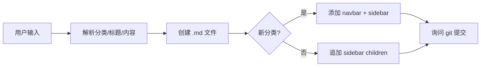

# Claude Code 全局 Skill：blog-note

在任意项目中通过 `/blog-note` 命令快速将技术笔记记录到 blog 知识库，自动创建 markdown 文件并更新导航配置。

## 背景

blog 项目是一个基于 VuePress 的个人技术知识库，按分类（http/vue/react/css/js/git/performance/canvas/regExp/softExamination/tool/weixin）组织文档。

每次手写笔记需要：
1. 在 `docs/document/{category}/` 下创建 markdown 文件
2. 编写 frontmatter
3. 更新 `navbar.ts` 添加导航入口
4. 更新 `sidebar.ts` 添加侧边栏链接

通过 `/blog-note` skill，一句话即可完成以上所有操作。

## Skill 安装

将 skill 文件放到 Claude Code 的全局 skills 目录：

```
~/.claude/skills/blog-note/skill.md
```

安装后，在任意项目中都可以直接使用 `/blog-note` 命令。

## 使用方式

### 一句话记录

```
/blog-note http 跨域解决方案 跨域是指浏览器同源策略限制，解决方案有 CORS、代理、JSONP 等
```

### 分步补充

```
/blog-note vue 响应式原理
内容：Vue 2 使用 Object.defineProperty，Vue 3 改用 Proxy
```

### 交互式引导

直接输入 `/blog-note`，Claude 会逐步引导你提供分类、标题和正文。

## Skill 执行流程



### 1. 解析输入

- **category**：`http` `vue` `react` `css` `js` `git` `performance` `canvas` `regExp` `softExamination` `tool` `weixin`
- **title**：文档标题，自动转换为 kebab-case 文件名
- **content**：Markdown 正文

### 2. 创建文件

路径：`docs/document/{category}/{title-kebab-case}.md`，自动生成 frontmatter：

```yaml
---
date: YYYY/MM/DD
category: {category}
---
```

### 3. 更新导航

自动更新 `docs/.vuepress/navbar.ts` 和 `docs/.vuepress/sidebar.ts`：
- 新分类：添加完整的 navbar 条目 + sidebar 条目
- 已有分类：追加 children 列表项

### 4. Git 提交

询问用户是否 `git add` + `commit` + `push`。

## 配置说明

### Navbar 配置 (`docs/.vuepress/navbar.ts`)

博文导航位于 `"/document/"` 的 children 数组中，每个分类为一个条目：

```ts
{
    text: "分类名",
    prefix: "category/",
    children: [
        {text: "文章标题", icon: "...", link: "文件名"},
    ],
},
```

### Sidebar 配置 (`docs/.vuepress/sidebar.ts`)

侧边栏配置位于 `"/document/"` 路径下：

```ts
{
    text: "分类名",
    icon: "...",
    prefix: "/document/category/",
    collapsible: true,
    children: ["文件名1", "文件名2"],
},
```

## 分类目录映射

| 分类 | 目录路径 | Navbar 显示名 |
|------|----------|---------------|
| `http` | `docs/document/http/` | http |
| `vue` | `docs/document/vue2/` | vue小记 |
| `react` | `docs/document/react/` | react小记 |
| `css` | `docs/document/css/` | CSS小记 |
| `js` | `docs/document/js/` | js小记 |
| `git` | `docs/document/git/` | git |
| `performance` | `docs/document/performance/` | 性能优化 |
| `canvas` | `docs/document/canvas/` | canvas |
| `regExp` | `docs/document/regExp/` | 正则表达式 |
| `softExamination` | `docs/document/softExamination/` | 软考小记 |
| `tool` | `docs/document/tool/` | 工具 |
| `weixin` | `docs/weixin/` | 小程序 |
