# jenkins

## PipeLine 任务配置

- 安装jenkins， 登录，下载所需插件
- 登录账号，新增Pipeline 任务
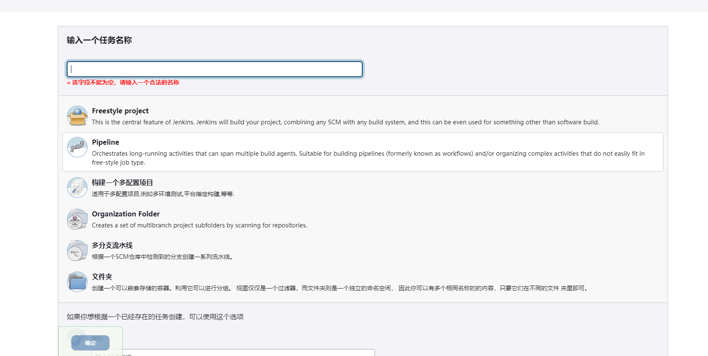

### 部署node express 应用 gitee push 自动发布

- 配置node 环境, 下载node, gitee插件
  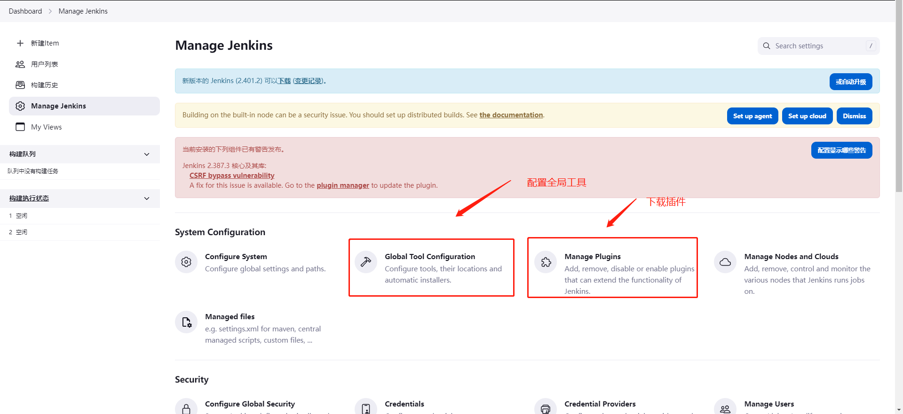
  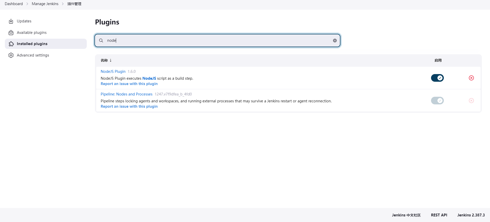
  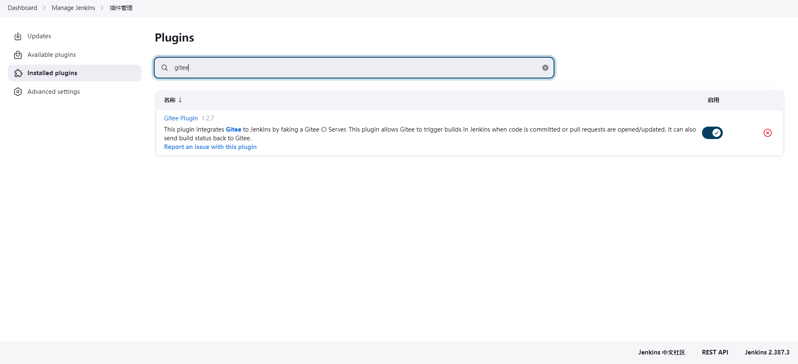
  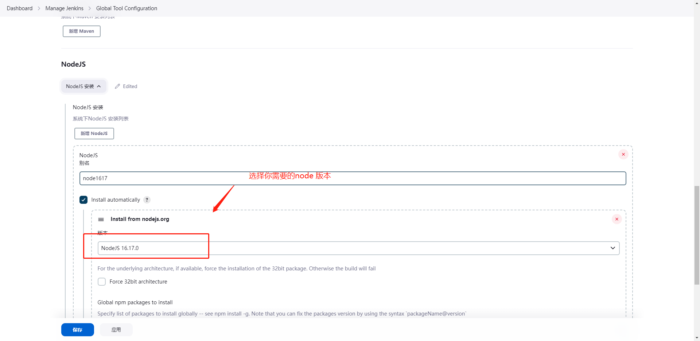
- 配置系统配置
  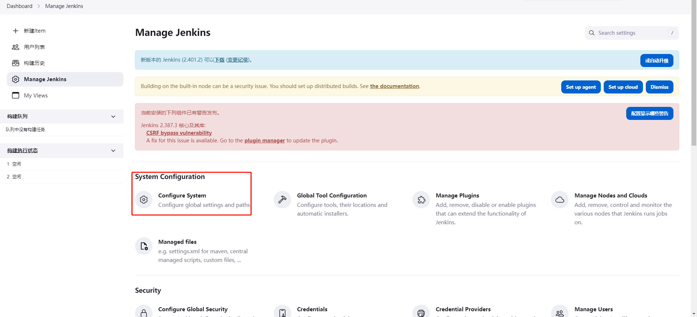
  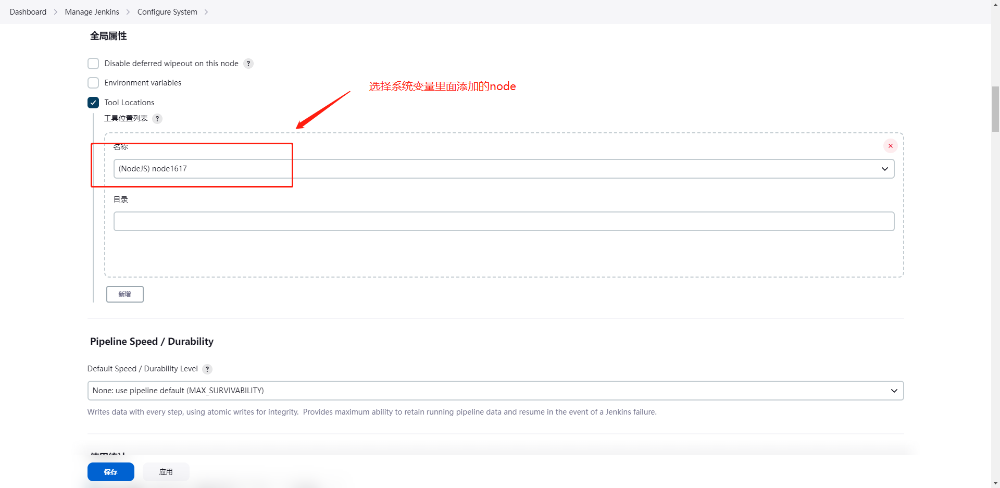
  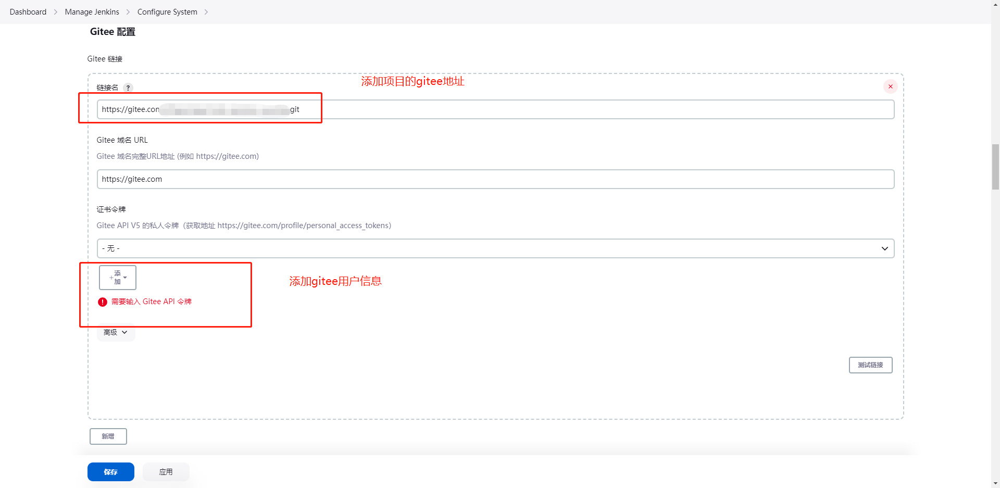
- 项目配置
  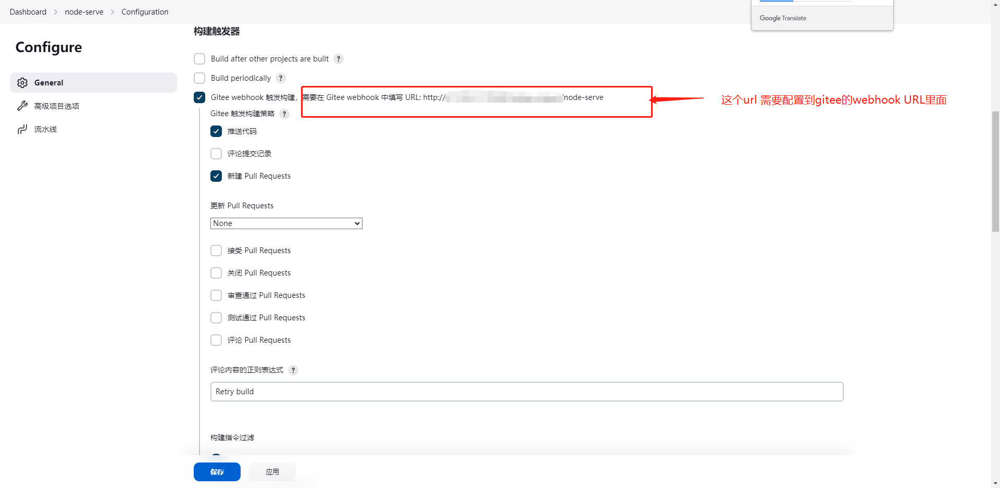

### 私有项目git发布配置
- 添加全局凭据

  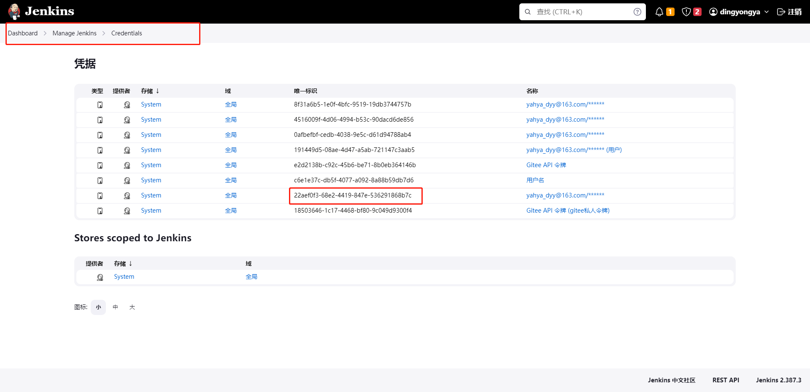
- 添加凭据id

  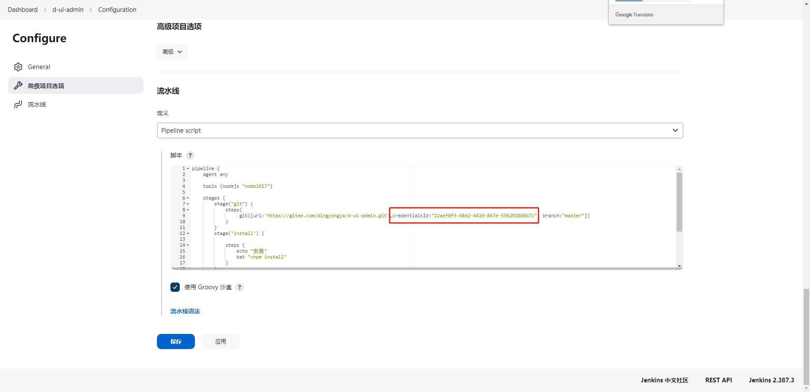

- 流水线命令
```shell

pipeline {
    agent any
    
    tools {nodejs "node1617"}  # 这里为我们上面配置的node 的名称
    
    stages {
        stage("checkout") {
            steps{
                 git([url:'https://gitee.com/项目地址.git',branch:"menu"])
            }
        }
        stage('install') {
          
            steps {
                echo "安装"
                bat "cnpm install" # window 用 bat ,linux 用 sh
            }
        }
         stage('delete') {
            steps {
                echo "删除"
                bat "npm run delete"
            }
        }
         stage('start') {
            steps {
                echo "启动"
                bat "npm run prd"
            }
        }
    
    }
}

```


