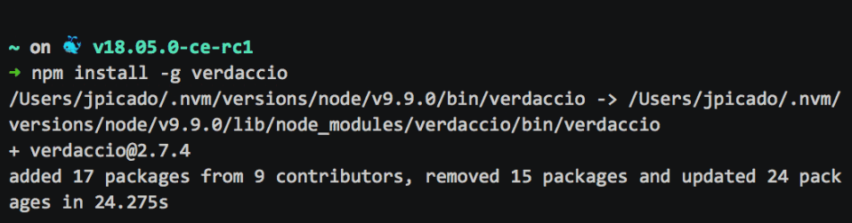
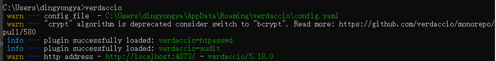
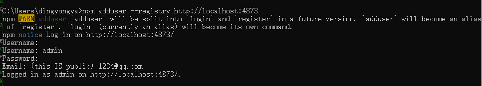

# Verdaccio

## 私有npm库的特点
- 私有npm仓库可以搭建在局域网内，不对外开放
- 对于发布和下载npm包可以进行权限管理
- 私有npm仓库可以管理私有包，不用上传到公共的npm仓库中
- 缓存下载过的npm包，再次下载的时候可以大大加快下载速度
- 对于私有包走私有仓库，下载过的包走缓存，为下载的包走公共仓库

## verdaccio 是什么

官网给出的简介：`Verdaccio`是一个Node.js创建的轻量级的私有`npm proxy registry`

verdaccio是fork的sinopia，后者是最初的搭建私有npm的选择，不过已经好多年不维护了，而verdaccio则是从sinopia衍生出来并且一直在维护中的，所以verdaccio是更好的选择

- 它是基于Node.js的网页应用程序
- 它是私有npm registry
- 它是本地网络proxy
- 它是可插入式应用程序
- 它相当容易安装和使用
- 我们提供Docker和Kubernetes支持
- 它与yarn, npm 和pnpm 100% 兼容
- 它forked于sinopia@1.4.0并且100% 向后兼容。

## Verdaccio 的搭建

### 全局安装
::: code-tabs#shell

@tab:active npm

```bash
npm install -g verdaccio
```

@tab yarn

```bash
yarn global add verdaccio
```

@tab pnpm

```bash
pnpm add -g verdaccio
```

:::



### Docker 镜像
安装完成后，你只需要执行CLI命令：
```shell
verdaccio
```
会输出如下结果：



其中第一行是 `verdaccio` 配置文件的目录，相关配置都在config.yaml中进行配置，[verdaccio配置文件文档](https://verdaccio.org/zh-cn/docs/configuration/)
```shell
 C:\Users\dingyongya\AppData\Roaming\verdaccio\config.yaml
```

http://localhost:4873 为 `verdaccio` 客户端的访问地址


### 登录到私有仓库上

```shell
npm adduser --registry http://localhost:4873
```



然后回到浏览器登录

### 发布 npm 包到私有仓库

```shell
npm publish --registry http://localhost:4873
```


### 从私有仓库中下载私有包
::: code-tabs#shell
@tab registry

```bash
npm install --registry http://localhost:4873
```

@tab .npmrc

```bash
registry=http://localhost:4873
```

@tab package.json

```bash
{
  "publishConfig": {
    "registry": "http://localhost:4873"
  }
}
```
:::

如需其他配置，请阅读 [使用私有 registry ](https://verdaccio.org/zh-CN/docs/cli-registry)部分。

### 缓存 npm 公共包
配置好私有仓库之后，每次我们下载公共包的时候，会自动把包文件缓存在
```shell
 C:\Users\dingyongya\AppData\Roaming\verdaccio\storage
```
私有包也是会存在storage这个文件夹下面的，当公共包被缓存之后，再次下载的时候，会首先在这个仓库中获取，大大的加速了包文件的下载速度，但是verdaccio官网上面显示缓存的过期时间默认是2分钟，如果想避免缓存的话可以在config.yml中设置 cache：false

```shell
uplinks:
  npmjs:
    url: https://registry.npmjs.org/
    cache: false
```
