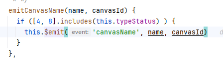
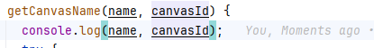
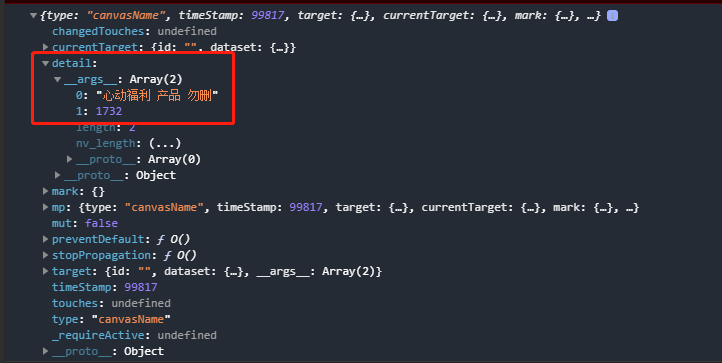
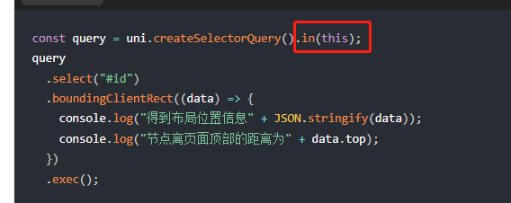

# 小程序

## .vue 和 .nvue 不同

`.vue`文件会使用webview进行渲染，`.nvue`会使用原生进行渲染.

进程 ： 独立内存空间

线程： 进程里面运行的为线程

## tabBar & 导航栏局限性

tabBar 暂不支持iconfont ，目前只支持APP  
导航栏不支持标题居中  

## 微信小程序 CSS border-radius元素 overflow:hidden失效问题 iPhone ios 苹果兼容问题

父元素使用border-radius 和 overflow：hidden；子元素使用了transform属性，父元素的overflow：hidden；会失效。

解决方法：父元素设置以下两个属性：

```css
-webkit-backface-visibility: hidden;
-webkit-transform: translate3d(0, 0, 0);
```

## 文字超出显示省略号

::: tip 注释
注意 `height` 属性，`line-height` 属性，必须设置，不然可能会把需要隐藏的展示出来
:::

```css
display: -webkit-box;
overflow: hidden;
text-overflow: ellipsis;
word-break: break-all;
-webkit-box-orient: vertical;
-webkit-line-clamp: 1; /*显示行数*/
```

## IOS 下载视频失败

::: tip 解决方式
压缩后下载即可
:::

## 太阳码参数问题

获取不限制的太阳码， 参数 注意：最大32可见字符； [获取不限制太阳码](https://developers.weixin.qq.com/miniprogram/dev/OpenApiDoc/qrcode-link/qr-code/getUnlimitedQRCode.html)

| 参数 |  描述 |
|:-----|------|
|page|默认是主页，页面 page，例如 pages/index/index，根路径前不要填加 /，不能携带参数（参数请放在scene字段里），如果不填写这个字段，默认跳主页面。scancode_time为系统保留参数，不允许配置|
|scene|最大32个可见字符，只支持数字，大小写英文以及部分特殊字符：!#$&'()*+,/:;=?@-._~，其它字符请自行编码为合法字符（因不支持%，中文无法使用 urlencode 处理，请使用其他编码方式）|

## 普通二维码跳转小程序

[文档地址](https://developers.weixin.qq.com/miniprogram/introduction/qrcode.html#%E5%8A%9F%E8%83%BD%E4%BB%8B%E7%BB%8D)

## uniapp 分包异步化导致的问题

uniapp 微信小程序分包异步化不支持js

子组件向父组件传值时，使用$emit时需要注意

如果子组件是通过分包异步化导入到父组件的时候

通过分包异步化跨包加载的vue 组件 通过$emit() 传递的参数会在 event.detail.__args__里面 __args__类型为数组





## 节点信息获取

uni.createSelectorQuery()  返回一个 SelectorQuery 对象实例。可以在这个实例上使用 select 等方法选择节点，并使用 boundingClientRect 等方法选择需要查询的信息

Tips:

使用 uni.createSelectorQuery() 需要在生命周期 mounted 后进行调用。
默认需要使用到 selectorQuery.in 方法。



跨自定义组件的后代选择器：.the-ancestor >>> .the-descendant

## base64 过长会导致白屏

本地缓存base64编码过长可能会导致白屏问题
